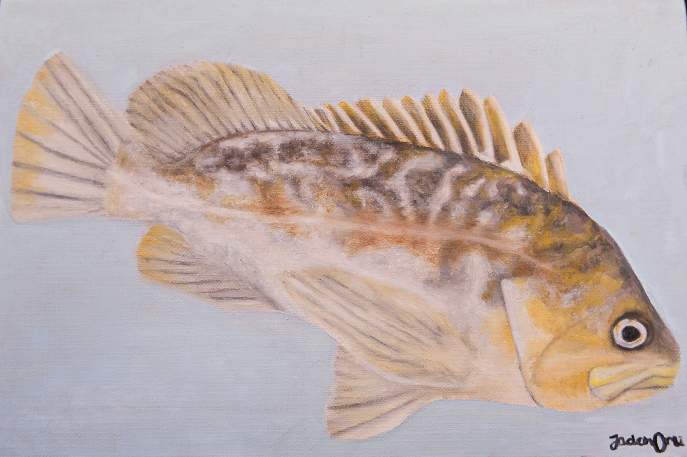
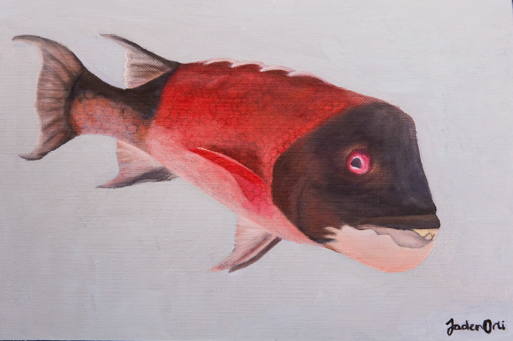
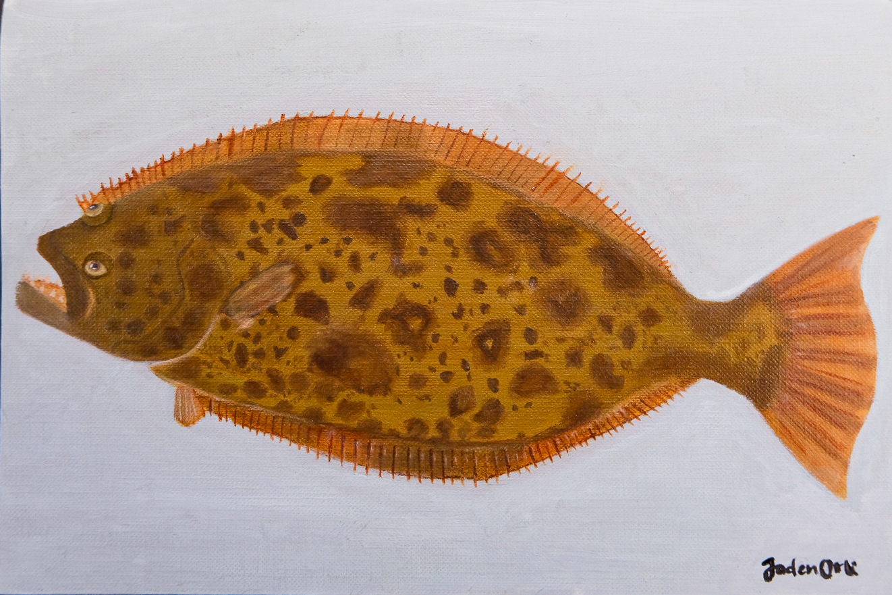
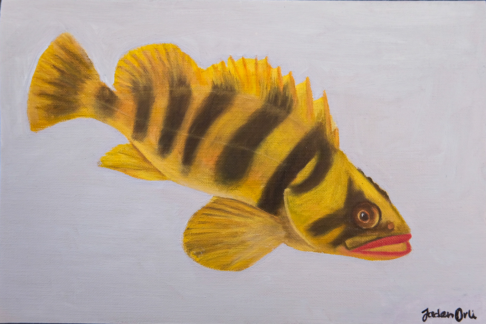
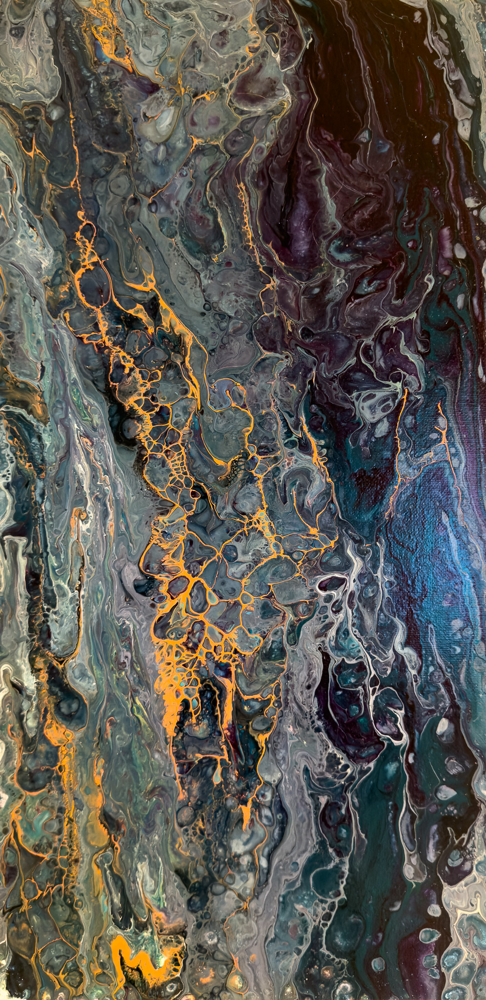
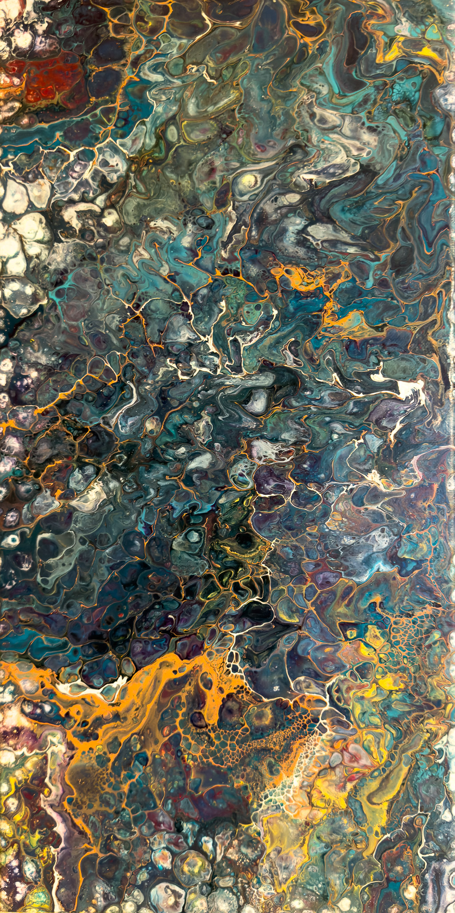
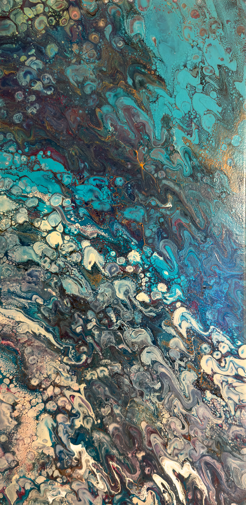

---
# =============================================================================
# art.qmd: the artwork gallery (renders to docs/art.html)
#
# A single masonry grid of 20 paintings and drawings, newest first, each one
# clickable into a Fancybox lightbox.
#
# Unlike the four photography galleries, this page is hand written rather than
# generated by scripts/render_gallery.R. That's the right call for 20 pieces
# with individual titles, years and media: a metadata CSV would be more
# machinery than the content needs.
#
# CHANGED FROM YOUR ORIGINAL:
#   1. Height cap on gallery images. The three Winogradsky canvases are tall
#      portraits and were running several times the height of everything else,
#      so the middle column became a wall of abstract texture while the outer
#      columns sat half empty. See section 30 of styles.css.
#   2. YAML format block removed: page-layout and toc are now site defaults.
#   3. Em dashes removed from comments and text.
# =============================================================================

title: ""
# Empty: the page opens with its own banner, so Quarto must not print a heading
# above it. Same pattern as index.qmd, research.qmd and photography.qmd.

pagetitle: "Artwork"
# Browser tab text and search result title.

# REMOVED: format: html: { page-layout: full, toc: false }
#   Both are now the site wide defaults in _quarto.yml, so restating them here
#   had no effect.
---

<!-- ===================================================================== -->
<!-- PAGE BANNER                                                           -->
<!--                                                                       -->
<!-- A still image rather than the looping video used on about, research   -->
<!-- and the photography galleries. styles.css §16 styles .page-banner img -->
<!-- and .page-banner video identically, so the two are interchangeable.   -->
<!--                                                                       -->
<!-- role="img" + aria-label are correct here: the banner holds no          -->
<!-- interactive children, so collapsing it to "one image with this         -->
<!-- description" is right. (On photography.qmd the same markup was hiding  -->
<!-- five clickable slides from screen readers, which is why it was removed -->
<!-- there but kept here.)                                                  -->
<!--                                                                       -->
<!-- FLAG: class="has-image" appears only on this page and has no rule in   -->
<!-- styles.css. It is inert. Left in place because it is harmless and may  -->
<!-- be a hook you intended to style later; delete it if not.               -->
<!-- ===================================================================== -->

  <!-- Absolutely positioned and cropped to fill by styles.css §16. The alt -->
  <!-- text here duplicates the aria-label above, which is harmless because -->
  <!-- role="img" on the parent means screen readers announce the label and -->
  <!-- ignore the children.                                                 -->
  
  <!-- 35% black scrim so the white title stays legible over the image.     -->
  

<!-- /.page-banner-overlay -->

  <!-- Raw <h1> rather than a Markdown heading, unlike the other pages.     -->
  <!-- It works, but it means this title does not join Quarto's search      -->
  <!-- index or the document outline. Worth making consistent eventually.   -->
  <h1 class="page-banner-title">Artwork</h1>
  
oil paint • mixed media • nature

<!-- /.page-banner-inner -->

<!-- /.page-banner -->

<!-- ===================================================================== -->
<!-- PAGE SPECIFIC STYLES                                                  -->
<!--                                                                       -->
<!-- These live here rather than in styles.css because they apply only to   -->
<!-- this one gallery. Anything reused elsewhere belongs in the stylesheet. -->
<!-- ===================================================================== -->
<!-- MOVED: the gallery's style block now lives in section 30 of styles.css.
     It was 50 lines of stylesheet inside a page, which meant a change to
     gallery styling had to be made in a different file from every other
     gallery rule on the site. Nothing about the rules changed. -->

<!-- ===================================================================== -->
<!-- THE GALLERY                                                           -->
<!--                                                                       -->
<!-- Two classes: .masonry supplies the column layout from styles.css §10   -->
<!-- (two columns, three above 900px), and .art-gallery scopes the tweaks   -->
<!-- above to this page only.                                              -->
<!--                                                                       -->
<!-- NOTE: no data-randomize attribute, unlike the photography galleries.   -->
<!-- scripts/site.js only shuffles a .masonry that asks to be shuffled, so  -->
<!-- this grid keeps its order. That is deliberate: the works are arranged  -->
<!-- newest to oldest, which is information a shuffle would destroy.        -->
<!--                                                                       -->
<!-- LIGHTBOX GROUP. data-fancybox groups anchors sharing the same value    -->
<!-- into one swipeable album. Every piece on this page uses "art", so       -->
<!-- clicking any one of them opens the lightbox and lets you page through   -->
<!-- the entire collection in page order, newest to oldest.                  -->
<!--                                                                         -->
<!-- One album rather than several is deliberate. A visitor who opens a      -->
<!-- painting is browsing, and breaking the set into sub albums would strand -->
<!-- them at the end of a three piece series with no way forward.            -->
<!-- ===================================================================== -->

  <!-- Each piece follows the same shape: a <figure> wrapping a lightbox    -->
  <!-- link, the image, and a <figcaption>.                                 -->
  <!-- role="group" + aria-labelledby name the figure for screen readers,   -->
  <!-- pointing at the id on its own title. Those ids must stay unique      -->
  <!-- across the page.                                                     -->
  <figure class="art-item" role="group" aria-labelledby="art-1-title">
    
    <figcaption class="art-caption">
      <strong id="art-1-title">Kelp Rockfish</strong> 
      2026 · Oil on canvas
    </figcaption>
  </figure>

  <figure class="art-item" role="group" aria-labelledby="art-2-title">
    
    <figcaption class="art-caption">
      <strong id="art-2-title">California Sheephead</strong> 
      2025 · Oil on canvas
    </figcaption>
  </figure>

  <figure class="art-item" role="group" aria-labelledby="art-3-title">
    
    <figcaption class="art-caption">
      <strong id="art-3-title">Pacific Halibut</strong> 
      2025 · Oil on canvas
    </figcaption>
  </figure>

  <figure class="art-item" role="group" aria-labelledby="art-4-title">
    
    <figcaption class="art-caption">
      <strong id="art-4-title">Treefish</strong> 
      2025 · Oil on canvas
    </figcaption>
  </figure>

  <figure class="art-item" role="group" aria-labelledby="art-5-title">
    
    <figcaption class="art-caption">
      <strong id="art-5-title">Juniper</strong> 
      2025 · Oil on canvas
    </figcaption>
  </figure>

  <figure class="art-item" role="group" aria-labelledby="art-6-title">
    
    <figcaption class="art-caption">
      <strong id="art-6-title">Haulover Bay</strong> 
      2024 · Oil on canvas
    </figcaption>
  </figure>

  <figure class="art-item" role="group" aria-labelledby="art-7-title">
    
    <figcaption class="art-caption">
      <strong id="art-7-title">Water World</strong> 
      2019 · Mixed media
    </figcaption>
  </figure>

  <figure class="art-item" role="group" aria-labelledby="art-8-title">
    
    <figcaption class="art-caption">
      <strong id="art-8-title">Fall Memories</strong> 
      2019 · Colored pencil on paper
    </figcaption>
  </figure>

  <!-- ~~~~~~~~~~~~~~~~~~~~~~~~~~~~~~~~~~~~~~~~~~~~~~~~~~~~~~~~~~~~~~~~~ -->
  <!-- WINOGRADSKY SERIES, three acrylic canvases from 2018.               -->
  <!-- CHANGED: these three use data-fancybox="art" rather than    -->
  <!-- "art", so the lightbox treats them as their own album. They are     -->
  <!-- also the tallest works on the page and the reason for the           -->
  <!-- max-height rule in the style block above.                           -->
  <!-- Kept in page order III, II, I to match the newest first ordering of -->
  <!-- the rest of the grid.                                               -->
  <!-- ~~~~~~~~~~~~~~~~~~~~~~~~~~~~~~~~~~~~~~~~~~~~~~~~~~~~~~~~~~~~~~~~~ -->
  <figure class="art-item" role="group" aria-labelledby="art-9-title">
    
    <figcaption class="art-caption">
      <strong id="art-9-title">Winogradsky III</strong> 
      2018 · Acrylic on canvas
    </figcaption>
  </figure>

  <figure class="art-item" role="group" aria-labelledby="art-10-title">
    
    <figcaption class="art-caption">
      <strong id="art-10-title">Winogradsky II</strong> 
      2018 · Acrylic on canvas
    </figcaption>
  </figure>

  <figure class="art-item" role="group" aria-labelledby="art-11-title">
    
    <figcaption class="art-caption">
      <strong id="art-11-title">Winogradsky I</strong> 
      2018 · Acrylic on canvas
    </figcaption>
  </figure>
  <!-- ~~~~~~~~~~~~~~~~~~~~ end Winogradsky series ~~~~~~~~~~~~~~~~~~~~~~ -->

  <figure class="art-item" role="group" aria-labelledby="art-12-title">
    
    <figcaption class="art-caption">
      <strong id="art-12-title">Virgin Gorda, BVI</strong> 
      2017 · Oil on canvas
    </figcaption>
  </figure>

  <figure class="art-item" role="group" aria-labelledby="art-13-title">
    
    <figcaption class="art-caption">
      <strong id="art-13-title">Lady</strong> 
      2015 · Oil on canvas
    </figcaption>
  </figure>

  <figure class="art-item" role="group" aria-labelledby="art-14-title">
    
    <figcaption class="art-caption">
      <strong id="art-14-title">Busy</strong> 
      2015 · Oil on canvas
    </figcaption>
  </figure>

  <figure class="art-item" role="group" aria-labelledby="art-15-title">
    
    <figcaption class="art-caption">
      <strong id="art-15-title">Tulips for Mom</strong> 
      2015 · Oil on canvas
    </figcaption>
  </figure>

  <figure class="art-item" role="group" aria-labelledby="art-16-title">
    
    <figcaption class="art-caption">
      <strong id="art-16-title">Rainbow Trout</strong> 
      2014 · Oil on canvas
    </figcaption>
  </figure>

  <figure class="art-item" role="group" aria-labelledby="art-17-title">
    
    <figcaption class="art-caption">
      <strong id="art-17-title">Tulip Fields</strong> 
      2014 · Oil on canvas
    </figcaption>
  </figure>

  <figure class="art-item" role="group" aria-labelledby="art-18-title">
    
    <figcaption class="art-caption">
      <strong id="art-18-title">Swimming Trout</strong> 
      2014 · Oil on canvas
    </figcaption>
  </figure>

  <figure class="art-item" role="group" aria-labelledby="art-19-title">
    
    <figcaption class="art-caption">
      <strong id="art-19-title">Breakfast Morning</strong> 
      2013 · Oil on canvas
    </figcaption>
  </figure>

  <figure class="art-item" role="group" aria-labelledby="art-20-title">
    
    <figcaption class="art-caption">
      <strong id="art-20-title">Waterfall Oasis</strong> 
      2012 · Oil on canvas
    </figcaption>
  </figure>

<!-- /.masonry.art-gallery -->

<!-- ===================================================================== -->
<!-- PAGE FOOTER: the action row that closes every content page.           -->
<!-- column-span:all in styles.css §10 makes it break out of the masonry   -->
<!-- columns rather than being poured into one like another artwork.       -->
<!-- ===================================================================== -->

  <a class="btn btn-primary" href="contact.html">Contact</a>
  <!-- href="#" scrolls to the top; smooth-scroll: true in _quarto.yml     -->
  <!-- animates the jump.                                                  -->
  <a class="read-more" href="#">Back to top</a>

<!-- /.gallery-footer -->
