<!-- Page banner with a single still image -->

  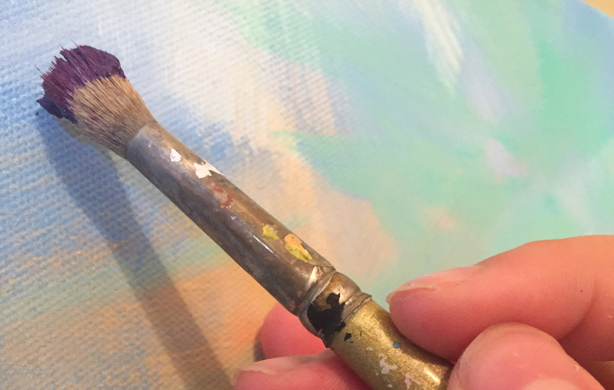
  

  <h1 class="page-banner-title">Artwork</h1>
  
oil paint • mixed media • nature

  <figure class="art-item" role="group" aria-labelledby="art-1-title">
    <a data-fancybox="art" href="artwork/juniper.jpg">
      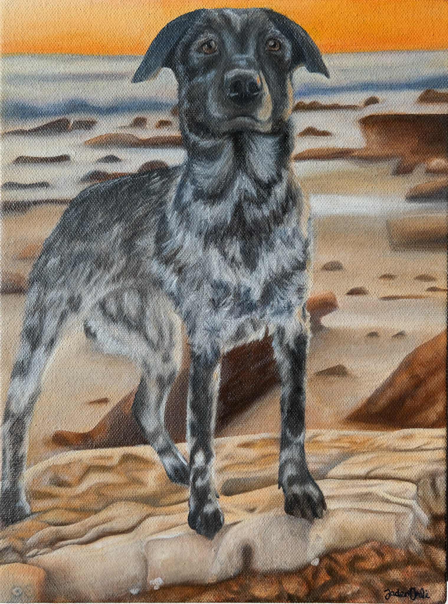
    </a>
    <figcaption class="art-caption">
      <strong id="art-1-title">Juniper</strong> 
      2025 · Oil on canvas
    </figcaption>
  </figure>
  
  <figure class="art-item" role="group" aria-labelledby="art-2-title">
    <a data-fancybox="art" href="artwork/haulover_bay.jpg">
      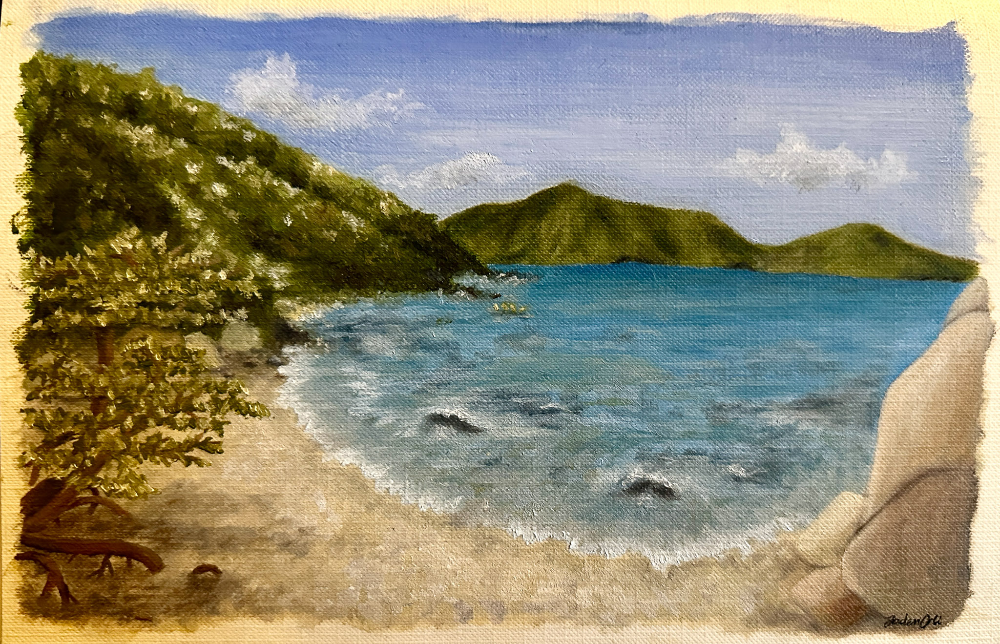
    </a>
    <figcaption class="art-caption">
      <strong id="art-2-title">Haulover Bay</strong> 
      2024 · Oil on canvas
    </figcaption>
  </figure>

  <figure class="art-item" role="group" aria-labelledby="art-3-title">
    <a data-fancybox="art" href="artwork/water_world.jpg">
      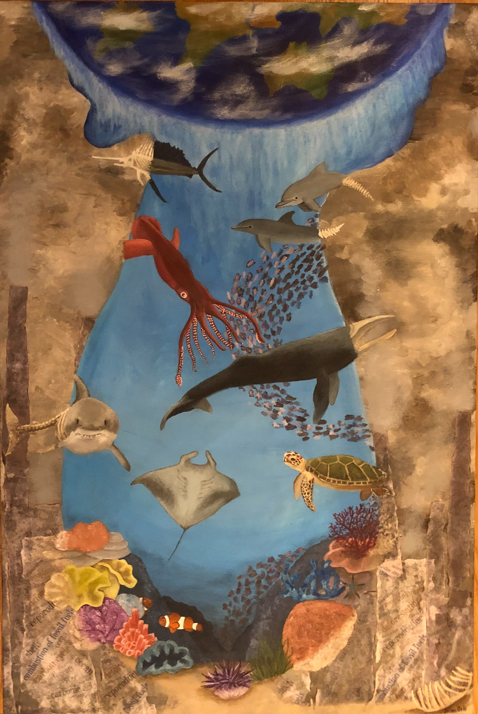
    </a>
    <figcaption class="art-caption">
      <strong id="art-3-title">Water World</strong> 
      2019 · Mixed media
    </figcaption>
  </figure>
  
  <figure class="art-item" role="group" aria-labelledby="art-4-title">
    <a data-fancybox="art" href="artwork/fall_memories.jpg">
      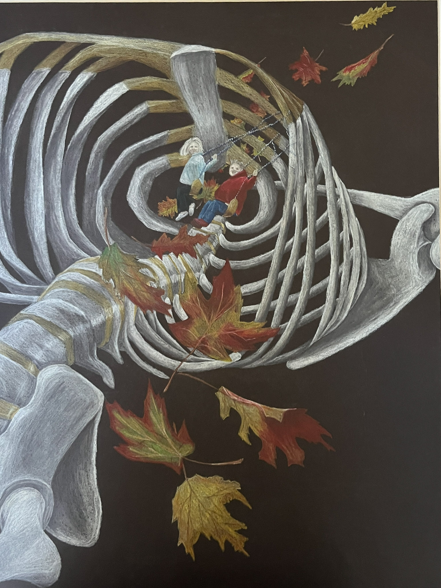
    </a>
    <figcaption class="art-caption">
      <strong id="art-4-title">Fall Memories</strong> 
      2019 · Colored pencil on paper
    </figcaption>
  </figure>

  <figure class="art-item" role="group" aria-labelledby="art-5-title">
    <a data-fancybox="art" href="artwork/virgin_gorda.jpg">
      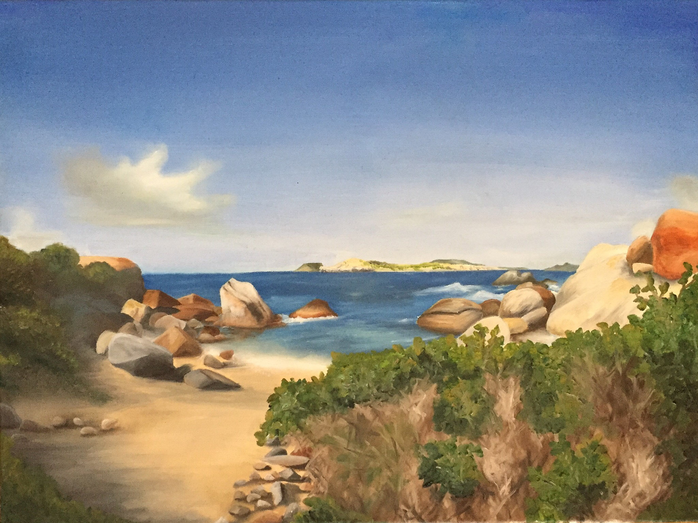
    </a>
    <figcaption class="art-caption">
      <strong id="art-5-title">Virgin Gorda, BVI</strong> 
      2017 · Oil on canvas
    </figcaption>
  </figure>

  <figure class="art-item" role="group" aria-labelledby="art-6-title">
    <a data-fancybox="art" href="artwork/lady.jpg">
      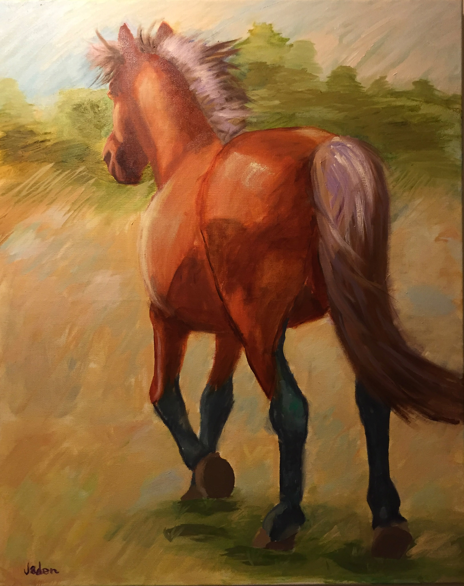
    </a>
    <figcaption class="art-caption">
      <strong id="art-6-title">Lady</strong> 
      2015 · Oil on canvas
    </figcaption>
  </figure>
  
  <figure class="art-item" role="group" aria-labelledby="art-7-title">
    <a data-fancybox="art" href="artwork/busy.jpg">
      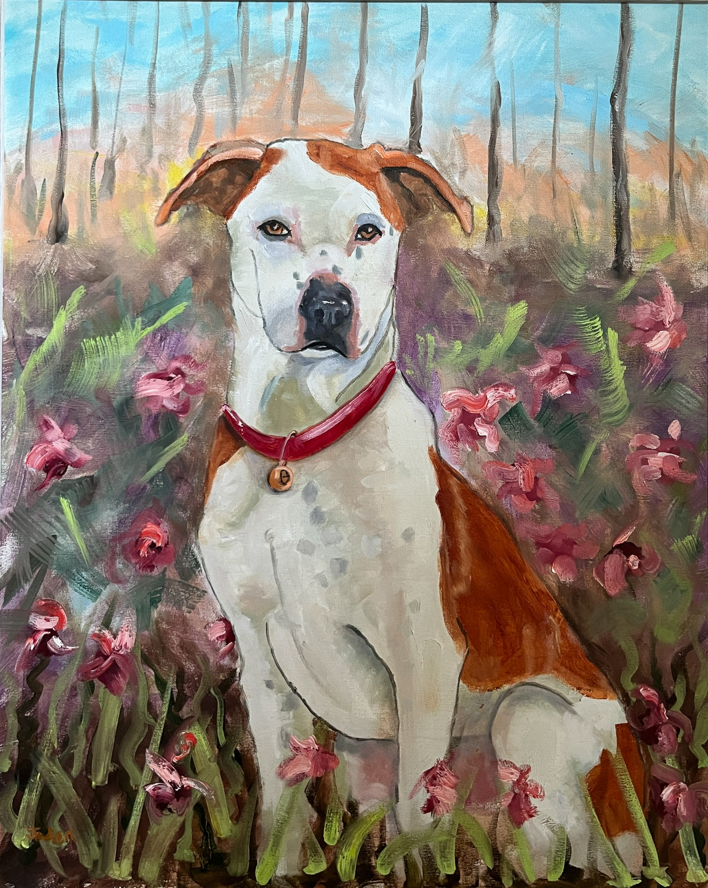
    </a>
    <figcaption class="art-caption">
      <strong id="art-7-title">Busy</strong> 
      2015 · Oil on canvas
    </figcaption>
  </figure>

  <figure class="art-item" role="group" aria-labelledby="art-8-title">
    <a data-fancybox="art" href="artwork/tulips.jpg">
      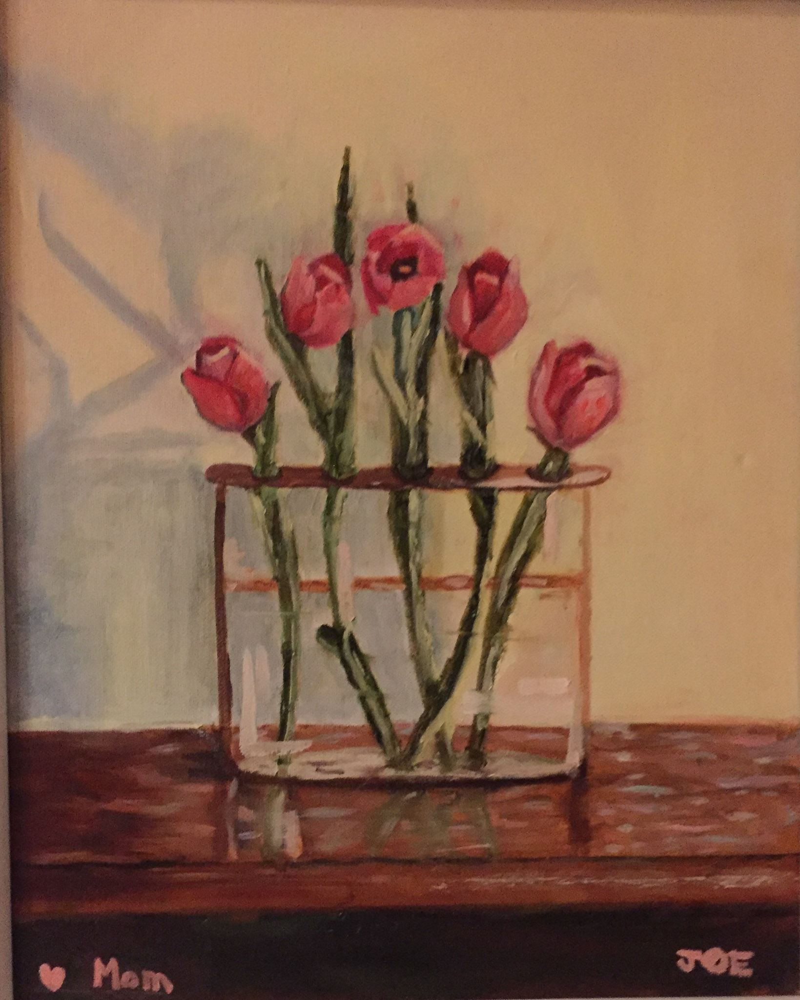
    </a>
    <figcaption class="art-caption">
      <strong id="art-8-title">Tulips for Mom</strong> 
      2015 · Oil on canvas
    </figcaption>
  </figure>
  
  <figure class="art-item" role="group" aria-labelledby="art-9-title">
    <a data-fancybox="art" href="artwork/rainbow_trout.jpg">
      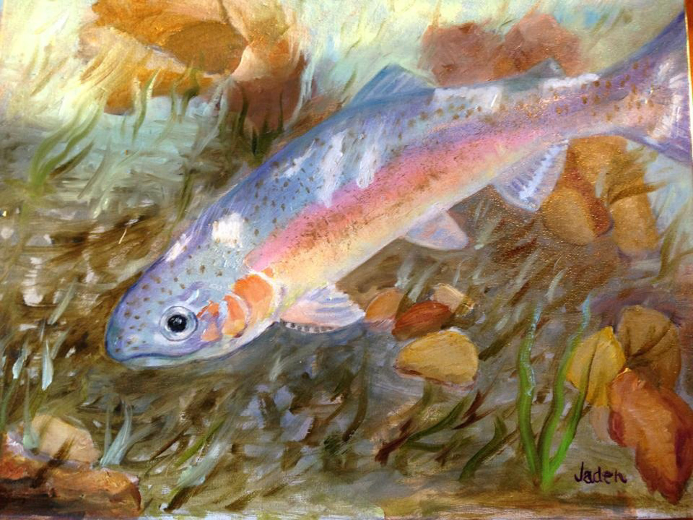
    </a>
    <figcaption class="art-caption">
      <strong id="art-9-title">Rainbow Trout</strong> 
      2014 · Oil on canvas
    </figcaption>
  </figure>

  <figure class="art-item" role="group" aria-labelledby="art-10-title">
    <a data-fancybox="art" href="artwork/tulip_fields.jpg">
      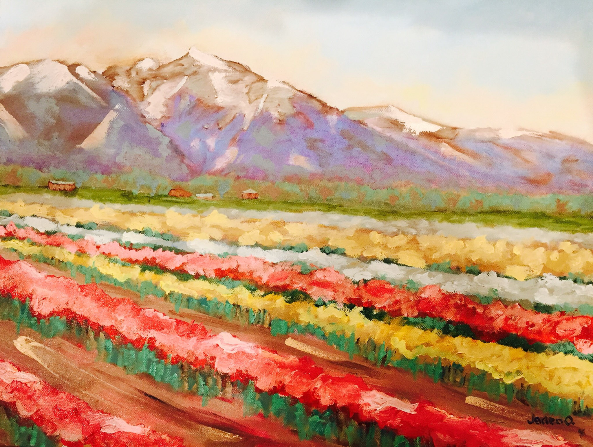
    </a>
    <figcaption class="art-caption">
      <strong id="art-10-title">Tulip Fields</strong> 
      2014 · Oil on canvas
    </figcaption>
  </figure>

  <figure class="art-item" role="group" aria-labelledby="art-11-title">
    <a data-fancybox="art" href="artwork/swimming_trout.jpg">
      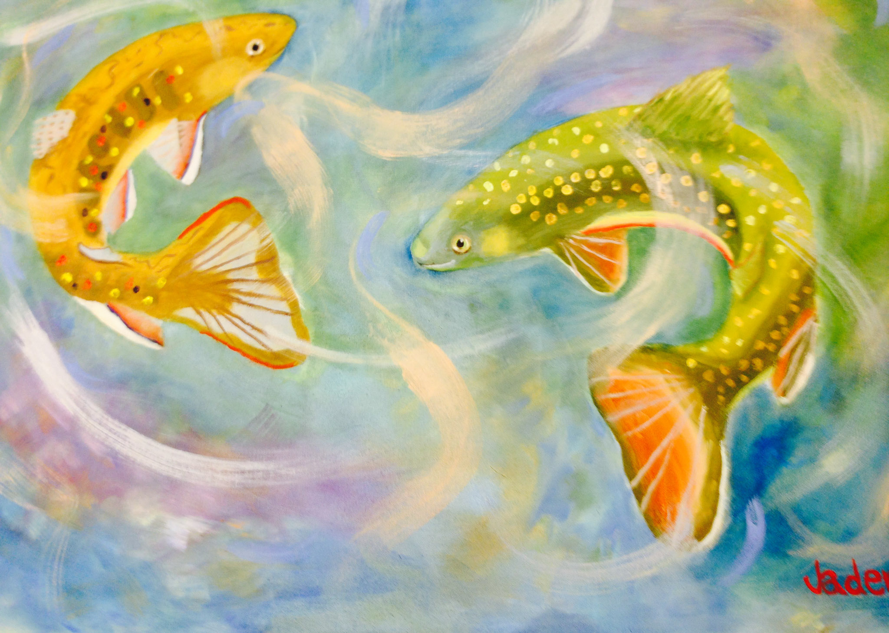
    </a>
    <figcaption class="art-caption">
      <strong id="art-11-title">Swimming Trout</strong> 
      2014 · Oil on canvas
    </figcaption>
  </figure>
  
  <figure class="art-item" role="group" aria-labelledby="art-12-title">
    <a data-fancybox="art" href="artwork/breakfast_morning.jpg">
      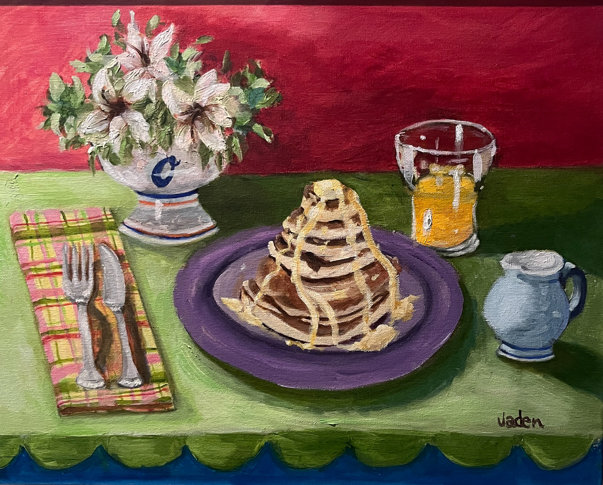
    </a>
    <figcaption class="art-caption">
      <strong id="art-12-title">Breakfast Morning</strong> 
      2013 · Oil on canvas
    </figcaption>
  </figure>

  <figure class="art-item" role="group" aria-labelledby="art-13-title">
    <a data-fancybox="art" href="artwork/waterfall_oasis.jpg">
      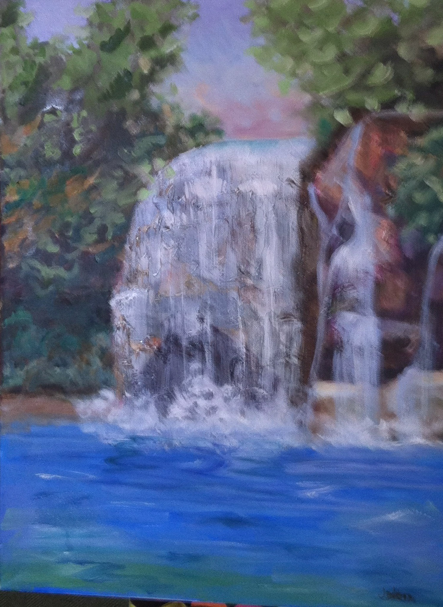
    </a>
    <figcaption class="art-caption">
      <strong id="art-13-title">Waterfall Oasis</strong> 
      2012 · Oil on canvas
    </figcaption>
  </figure>

 <!-- end .masonry.art-gallery -->

  <a class="btn btn-primary" href="contact.html">Contact</a>
  <a class="read-more" href="#">Back to top</a>

