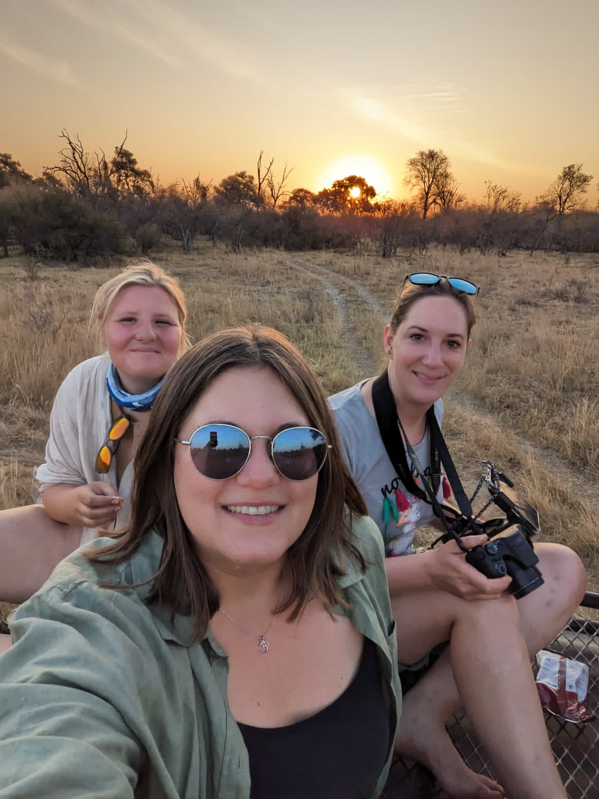
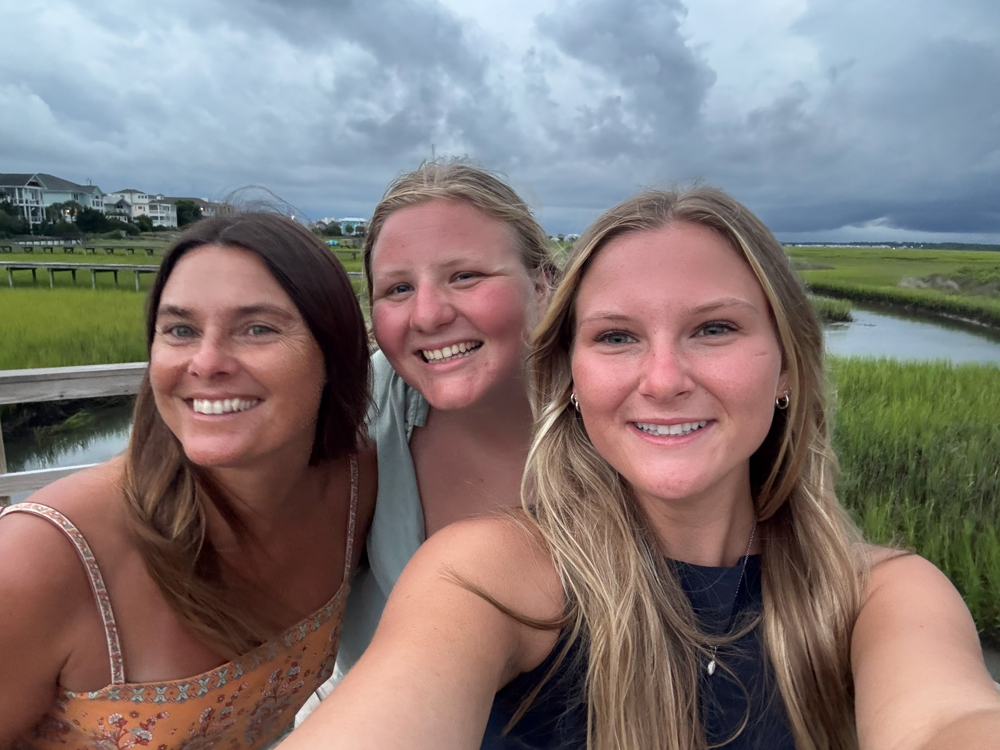
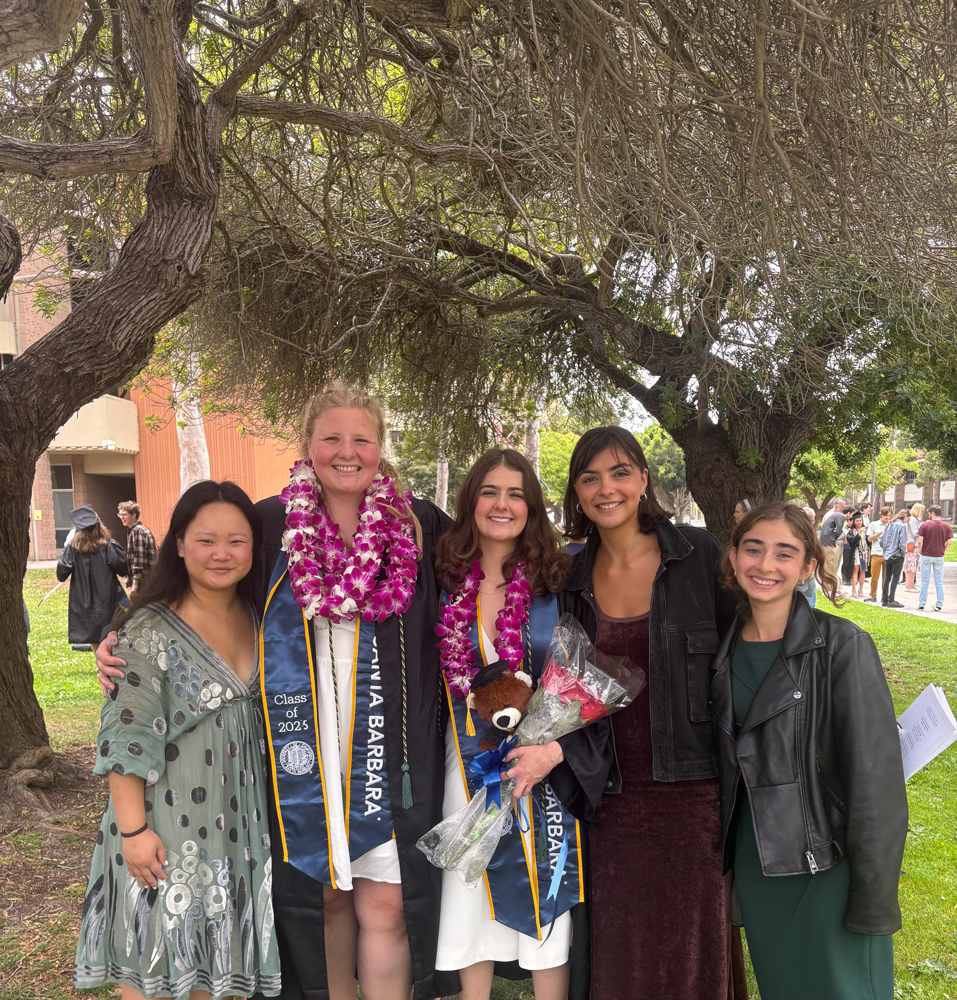
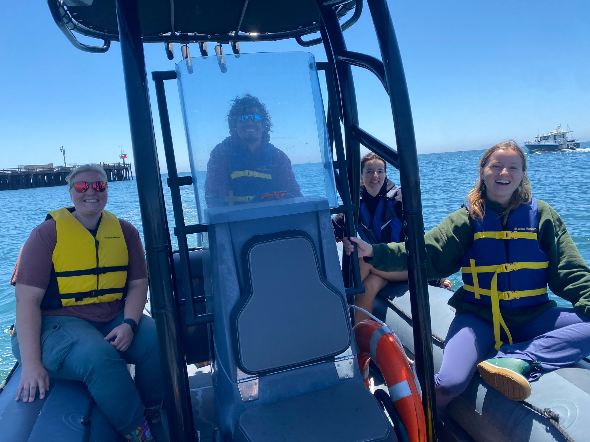

<!-- Banner with slideshow background -->

  

  
  
  
  
  
  

  

  

# Contact {.page-banner-title}

get in touch • collaborate • say hello

  

<!-- Intro line -->

I'm always happy to talk science, collaboration, photography, or fieldwork — don't hesitate to reach out.

<!-- Contact panel -->

  

## Reach Me

  <h3 id="contact-direct-title">Direct</h3>
  <ul class="contact-list">
    <li><strong>Email:</strong> <a href="mailto:jadenorli@gmail.com">jadenorli@gmail.com</a></li>
    <li><strong>Phone:</strong> <a href="tel:+3368290234">(336) 829-0234</a></li>
  </ul>
  

  
Mailing

  

  

**Location**  
Santa Barbara, CA (often traveling along the California coast)
  

  

**Affiliation**  
UCSB · College of Creative Studies (Biology) · Marine Science Institute
  

  

  

  <h3 id="contact-links-title">Links</h3>
  

    <a class="read-more" href="https://www.linkedin.com/in/jadenorli" target="_blank" rel="noopener">LinkedIn</a>
    <a class="read-more" href="https://github.com/jadenorli" target="_blank" rel="noopener" aria-label="GitHub profile">GitHub</a>
    <a class="read-more" href="files/jaden_2026_resume.pdf" target="_blank" rel="noopener" aria-label="Resume PDF">Resume (PDF)</a>
  

<!-- /.stacked-cards -->
  

<!-- CTA coral banner -->

  Prefer email? Click to start a message:
  <a class="btn btn-primary" href="mailto:jadenorli@gmail.com" style="margin-left:.5rem">Email Me</a>

