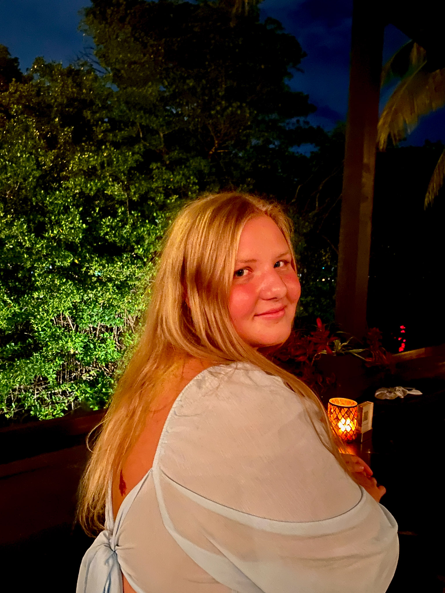

::: {.homepage-header}
{.profile-photo alt="Jaden Orli"}

::: {.bio-text}
Hi there! I'm **Jaden Orli**, a marine biologist and ecological modeler passionate about linking science, policy, and storytelling. I recently earned my BA in Biology from UC Santa Barbara, where I studied marine ecology, fisheries management, and conservation. My work spans field surveys in salt marshes and kelp forests, modeling California spiny lobster dynamics, and creating visual media to inspire engagement with ocean issues.
:::

::: {.homepage-links}
[LinkedIn](https://www.linkedin.com/in/jadenorli/){target="_blank"} | 
[GitHub](https://github.com/jadenorli){target="_blank"} | 
[Email](mailto:jadenorli@gmail.com)
:::
:::
