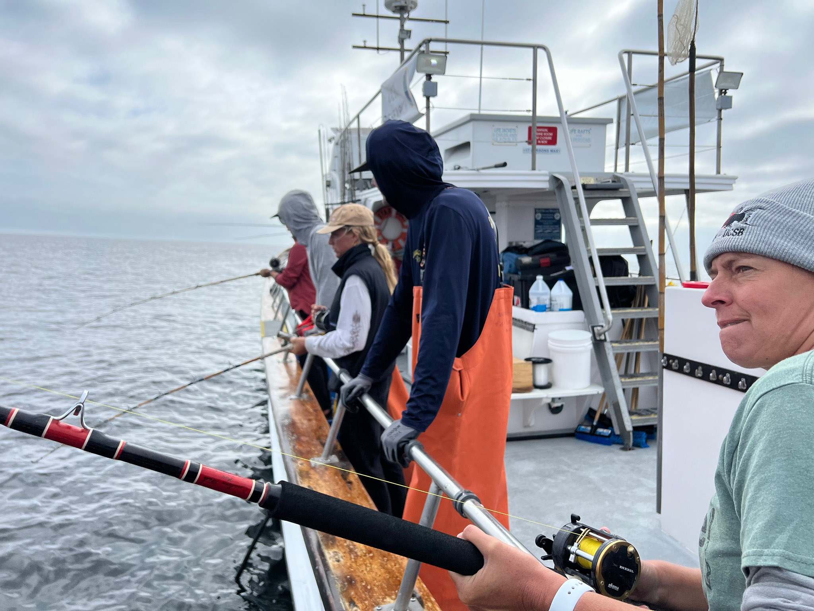

## Overview

Five months in the Caselle Lab at the University of California, Santa Barbara, across two long-running monitoring programs that ask the same question from opposite ends of the water column: is protection working, and how would we know?

Most of the time went underwater, on standardized subtidal surveys at the Northern Channel Islands. The rest went to nearshore fisheries work from sportfishing vessels. The two programs reach different fish by design, which is why a protected area is judged by both rather than either.

::: {.table-card}

| | Kelp forest surveys[^pisco] | Nearshore fisheries[^ccfrp] |
|---|---|---|
| Gear | Divers on fixed transects | Hook and line, volunteer anglers |
| Catches | Reef fish, invertebrates, algae | Fish deeper than a transect reaches |
| Sites | Northern Channel Islands | Protected areas and fished references |
| Handling Animals | Counted, left alone | Caught, measured, tagged, released |
| My Part | Diving, identification, boat work, data checks | One cruise, tagging, otolith dissections |

:::

Where this monitoring lands

Open dataset, contributed to

Carr, M. H., J. E. Caselle, B. N. Tissot, D. J. Pondella, D. P. Malone, K. D. Koehn, J. T. Claisse, J. P. Williams, A. Parsons-Field and S. F. Craig. 2024. <em>Monitoring and Evaluation of Kelp Forest Ecosystems in the Marine Life Protection Act Marine Protected Area Network</em>. California Ocean Protection Council Data Repository, released under a Creative Commons Attribution license.

<a class="cite-chip" href="https://obis.org/dataset/a6155d3d-48b8-4778-83aa-776b459a75d1" target="_blank" rel="noopener"><i class="bi bi-database" aria-hidden="true"></i>Browse the Dataset</a>

What the record is used for

Spiecker, B., M. H. Carr, D. P. Malone, A. Parsons-Field, K. D. Koehn, D. J. Pondella and J. E. Caselle. 2025. Measuring biological effectiveness across a very large, coherent network of coastal marine protected areas. <em>Ecological Applications</em>.

<a class="cite-chip" href="https://doi.org/10.1002/eap.70074" target="_blank" rel="noopener"><i class="bi bi-journal-text" aria-hidden="true"></i>Read the Paper</a>

## Quick Facts

- **Role:** Scientific Diver and Field Research Assistant, Caselle Lab, University of California, Santa Barbara
- **When:** June 2024 to October 2024
- **Where:** Northern Channel Islands, nearshore waters off the Santa Barbara coast, and the Caselle Lab
- **Skills:** subtidal visual survey methods, fish and invertebrate identification, small boat operations, otolith dissection, data entry and quality control
- **Funding:** student diver support under California Sea Grant project R/MPA-49A, *Monitoring and Evaluation of Kelp Forest Ecosystems in the Marine Life Protection Act Marine Protected Area Network*, funded by the California Ocean Protection Council<!-- CONFIRM: the project's 2024 reporting lists you under leveraged funds rather than direct Sea Grant dollars. If you know which leveraged source paid you (the campus Coastal Fund line supported student divers), name it here instead. -->
- **Credits:** listed among the students involved in the project's 2024 reporting to California Sea Grant[^report]

## Kelp Forest Surveys

**What the surveys are.** Standardized transects repeated at fixed sites, year after year, by divers using identical methods. Four sampling methods run at each site, all of them visual and all of them on scuba: fish are counted along belt transects, while invertebrates and macroalgae are recorded on transects that overlap those but are laid out separately. Sites are surveyed annually in summer or early fall, typically two to four inside a given protected area and two to four outside it, which is what makes an inside and outside comparison possible at all.[^data]

The value is entirely in the repetition. A single year's numbers say very little, and two decades of them say how a reef is changing and whether a boundary on a map is making a difference.

**My part.** Diving the surveys and recording the data, with the identification work that goes with it, plus small boat operations and gear logistics for island trips. Back on land, data entry and the checking that follows, reconciling dive logs against sheets and validating species codes before anything reached a database.

**The season, in numbers.** Sixty eight scientific dives across twenty days in the water between June and October 2024, at twenty one sites spread over four islands and the Santa Barbara coast: Anacapa and Santa Cruz carried most of it, with shorter trips to Santa Rosa and San Miguel. Three or four dives a day was normal and five was the ceiling, at a median depth of ten meters and a median bottom time of forty four minutes, which comes to about forty nine hours underwater over the season.

<!-- ONE BLANK LEFT ON THIS PAGE.

     PHOTOGRAPHS. This is the only project page with nothing but a hero,
        and it is the one page where you already have the pictures: your own
        photography section is full of kelp forest work. Three that would
        carry this section are a diver on a transect tape, a fish count in
        progress, and the boat or gear between dives. Copy them into
        images/research/ and uncomment.

<figure>
  
  <figcaption>The transect. CAPTION</figcaption>
</figure>

<figure>
  
  <figcaption>Counting. CAPTION</figcaption>
</figure>

-->

## Nearshore Fisheries Monitoring

The California Collaborative Fisheries Research Program samples with hook and line rather than with divers, working from sportfishing vessels with volunteer anglers, and catches, measures and releases nearshore fish inside marine protected areas and at matched reference sites. It reaches fish and depths a diver transect does not, which is why the two programs sit next to each other here.

**My part was small, and worth saying plainly.** One survey cruise, and five to ten otolith dissections in the laboratory from fish collected on program trips. Otoliths are the ear stones that lay down growth rings, so a dissection turns a length measurement into an age, which is what a stock assessment needs and what a catch and release survey cannot get on its own.

## Where the Data Goes

Both programs are long-term monitoring rather than discrete projects, and nothing collected on a survey day belongs to the diver who collected it. What happens to it instead is the point.

Survey records are checked, standardized across the four institutions that dive this program, and published openly in the California Ocean Protection Council Data Repository, with a mirror in the Ocean Biodiversity Information System. Those records are what network-scale evaluations are built from, including a recent assessment of biological effectiveness across the whole 1,350 kilometer span of California's marine protected area network. Both are linked at the top of this page. The reason a season of counting fish is worth doing is sitting at the far end of that chain.

## Acknowledgments

Caselle Lab at the University of California, Santa Barbara, the Partnership for Interdisciplinary Studies of Coastal Oceans, the California Collaborative Fisheries Research Program and its volunteer anglers and boat captains, and Channel Islands staff for logistics and access.

<a class="read-more" href="research.html">Back to Research</a>
<a class="btn btn-primary" href="contact.html">Contact</a>

[^pisco]: The Partnership for Interdisciplinary Studies of Coastal Oceans is a long-term kelp forest monitoring program administered from the University of California campuses at Santa Cruz and Santa Barbara, surveying rocky reefs across California since 1999 and focusing on marine protected areas since 2007. <https://www.piscoweb.org/>

[^ccfrp]: The California Collaborative Fisheries Research Program is a community-based monitoring program run with volunteer anglers, boat captains and researchers at six California universities, including the University of California, Santa Barbara. It uses standardized hook and line surveys to catch, identify, measure, tag and release fish inside marine protected areas and at paired reference sites open to fishing. <https://www.ccfrp.org/>

[^report]: California Sea Grant project R/MPA-49A, *Monitoring and Evaluation of Kelp Forest Ecosystems in the Marine Life Protection Act Marine Protected Area Network*, led by Mark Carr with the Santa Barbara component led by Jennifer Caselle. Project page: <https://caseagrant.ucsd.edu/our-work/research-projects/monitoring-and-evaluation-kelp-forest-ecosystems-mlpa-marine-protected>

[^data]: Survey design, sampling methods and timing as described in the metadata for the published dataset, cited in full at the top of this page. <https://obis.org/dataset/a6155d3d-48b8-4778-83aa-776b459a75d1>
