<!-- Hero slideshow. Styles from section 17 of styles.css, timer from
     scripts/site.js, which initialises every .hero-slideshow on the site. -->

  
  <a href="images/research/kuris_nicothoid_1.jpg" data-fancybox="kuris-hero">
    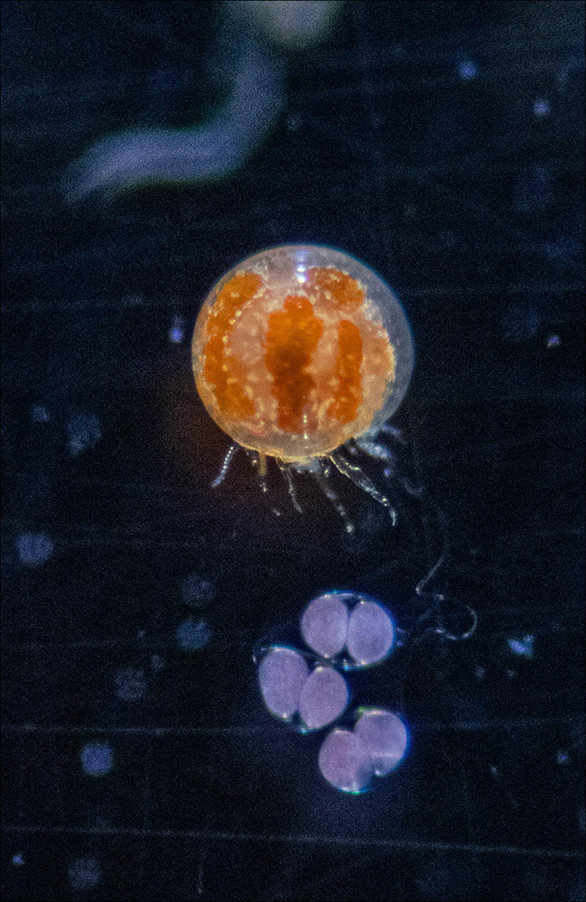
  </a>
  <a href="images/research/kuris_nicothoid_2.jpg" data-fancybox="kuris-hero">
    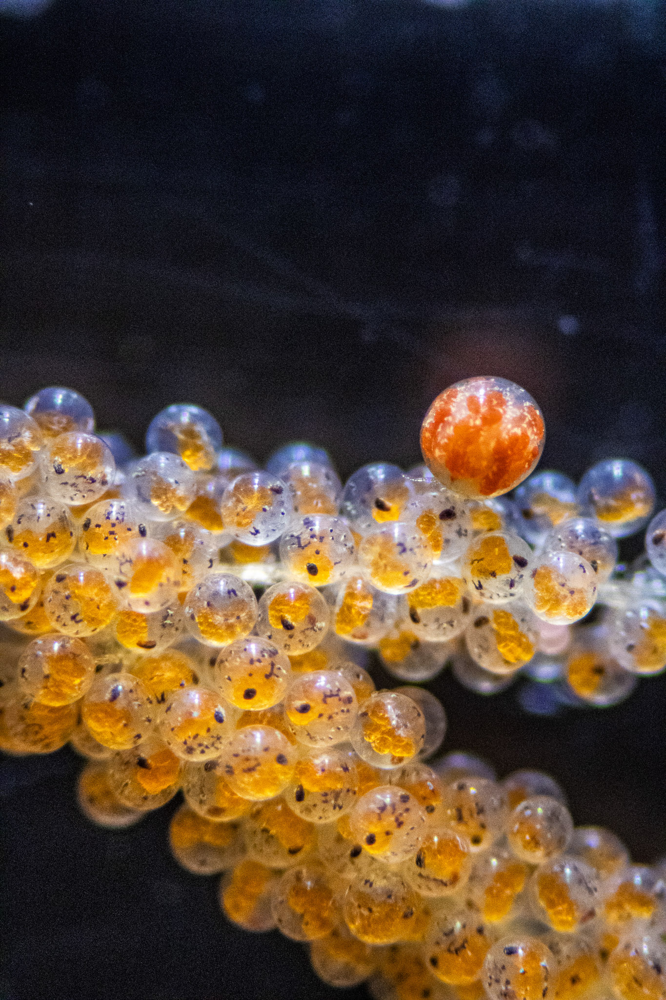
  </a>
  <a href="images/research/kuris_nicothoid_3.jpg" data-fancybox="kuris-hero">
    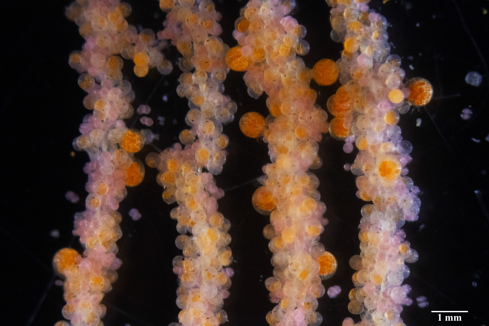
  </a>
  <a href="images/research/kuris_nicothoid_4.jpg" data-fancybox="kuris-hero">
    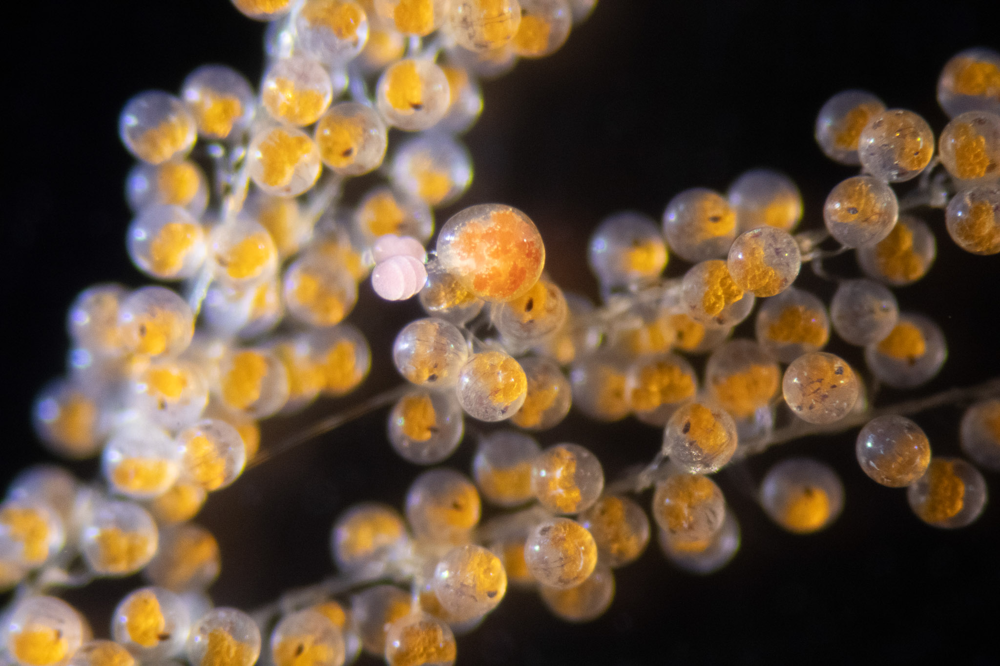
  </a>

## Overview

In an invertebrate biology teaching laboratory in October 2021, a demonstration of crab egg predators turned up something that was not supposed to be there. Brooding Pacific rock crabs from the Gaviota Coast carried a **nicothoid copepod egg predator** (Nicothoidae, cf. *Choniosphaera* sp.), sitting among the host's eggs at nearly the same size and color as the eggs themselves.

Follow-up collections found it on three commercially important cancrid crabs, at intensities high enough to turn an entire brood maroon. This work is the first record of a nicothoid egg predator on cancrid crabs anywhere in the Eastern Pacific. It describes the parasite's life cycle across two microhabitats, the egg mass and the gills, and asks what a near-universal egg predator means for the reproductive output of a fishery nobody is closely watching.

Published in Ecology

<strong>Orli, J. E.</strong>, S. M. Lecuona, G. O. Plewe, C. N. Gadler, A. M. Kuris, D. Tang and Z. L. Zilz. 2025. Discovery of an unidentified species of nicothoid copepod infesting cancrid crabs in Santa Barbara, California. <em>Ecology</em> 106(12): e70263.

<a class="cite-chip" href="https://doi.org/10.1002/ecy.70263" target="_blank" rel="noopener"><i class="bi bi-journal-text" aria-hidden="true"></i>Read the paper</a>
<a class="cite-chip" href="https://doi.org/10.5061/dryad.rv15dv4fw" target="_blank" rel="noopener"><i class="bi bi-database" aria-hidden="true"></i>Data and code on Dryad</a>
<a class="cite-chip" href="https://doi.org/10.5281/zenodo.10699477" target="_blank" rel="noopener"><i class="bi bi-play-circle" aria-hidden="true"></i>Videos on Zenodo</a>

## Quick Facts

- **Role:** Lead author, Kuris Lab, University of California, Santa Barbara
- **When:** 2021 to 2025
- **Hosts:** *Metacarcinus anthonyi*, *Romaleon antennarium*, *Cancer productus*
- **Where:** baited traps at 66 to 100 meters along the Gaviota Coast, plus additional Southern California sites
- **Project type:** Scientific Naturalist: discovery, natural history and fishery context
- **Skills:** field collections, crab identification, dissection, brood stage scoring, parasite life history description, figure and media design, open data curation

## Background and Questions

Externally brooding crustaceans carry a long list of egg predators, from nemerteans to copepods, and those predators can take large fractions of a brood. Some have been implicated in fishery collapses. Nicothoid copepods are specialized crustacean associates that commonly mimic their host's eggs and feed on yolk through the egg shell, which is exactly what makes them easy to miss: at a glance, an infested brood looks like a brood.

- How common is this nicothoid on California rock crabs, and which host stages carry it?
- How does its life cycle use the egg mass and the gills as separate microhabitats?
- What does near-universal infestation mean for the fecundity and management of a data-poor fishery?

## Methods

**Discovery and collections.** The first specimens came out of a teaching demonstration rather than a survey. Targeted collections followed: ovigerous cancrids taken by local fishers in baited pots at 66 to 100 meters along the Gaviota Coast, then held in flow-through seawater so that broods could be inspected repeatedly rather than once.

**Host and parasite observations.** Each crab was identified to species, with sex, size and reproductive status recorded. Egg masses were scored by egg developmental stage and examined for adult female nicothoids, their egg sacs and embryos, nauplii and copepodids, and for co-occurring egg predators such as *Carcinonemertes* species. Gill lamellae were inspected in both sexes, which is where the second half of the life cycle turned out to be.

**Life cycle synthesis.** Adult females were tracked through their color and size change, from yellow and orange when small to maroon when large and heavily gravid, and their egg sacs were characterized from structure through development: one to four embryos per sac, embryo to nauplius to copepodid. Timing of copepodid peaks in the egg mass, and their presence in gills before and after hatching, is what makes it possible to infer how the parasite crosses from one brood to the next.

<!-- ROOM FOR METHOD PHOTOGRAPHS.
     This section is the only one on the page carrying no image, and it is the
     one where a picture would do the most: a reader who has never seen this
     work has no idea what any of it looks like. Drop three into a figure-grid
     here, in this order, and the section stops being a wall of text:

       1. the fishery end: a baited pot coming up, the deck, or the boat
       2. the bench: the dissecting scope with a crab under it, or a brood
          being teased apart
       3. an egg developmental stage series, or a scored egg mass alongside
          the sheet it was scored on

     Markup to fill in, matching the figure sections below:

     

       <figure>
         
         <figcaption>Collections. CAPTION</figcaption>
       </figure>
     

-->

## Key Results

<h4>A novel nicothoid on Eastern Pacific cancrids</h4>

The parasite matches <em>Choniosphaera</em> on the traits that matter in an adult female: globular body, ventral mouthparts, leg and antennule morphology. It differs enough to remain unidentified at species level.

It is the first nicothoid egg predator reported on cancrid crabs in the Eastern Pacific, despite decades of egg masses being opened in the search for nemertean predators.

<h4>Nearly every breeding host carried it</h4>

Across all three host species, almost every adult examined had at least one nicothoid life stage, on the egg mass, in the gills, or both.

Ovigerous females routinely carried reproductive adult females on their broods. Only a handful of juveniles and long-held males were completely clear.

<h4>The eggs are being eaten</h4>

Adults sit among the host's eggs, pierce the shell and consume the yolk, leaving empty or degraded capsules behind and opening the way for microbial invasion.

A heavily infested brood reads as maroon, the color of dense pink nicothoid eggs laid over the crab's own. Copepodid densities peak late in host egg development, which is what cumulative exposure across a roughly forty five day brooding period looks like.

<h4>Gills bridge one clutch to the next</h4>

Copepodids occur on the gill lamellae of both sexes, including on females that went on to extrude a new clutch.

In some of those females, copepodids appeared in the new egg mass within a day and adults within nine, which points to transfer from gill to egg at oviposition, and to the gills as the reservoir in between.

<h4>A data-poor fishery, and an open question</h4>

A conspicuous parasite appearing suddenly on a well-studied crab assemblage has two plausible explanations: a native species that becomes abundant in decadal pulses, as reported for <em>Choniosphaera</em> in the Atlantic, or a recent host shift onto cancrids.

Either way, California rock crabs are under-managed and data-limited, and an egg predator this common could erode reproductive output and year-class strength without anyone measuring it.

## Figures

Both figures are from the published paper. Click any panel to open it full size; hover over a sequence to pause it.

### Figure 1. Adults on the egg mass

<figure>

  <a href="images/research/nicothoid_fig1a_seq1.jpg" data-fancybox="fig1a-seq" class="active">
    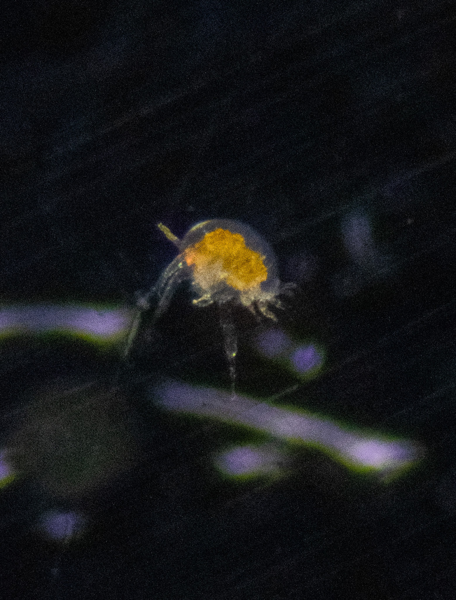
  </a>
  <a href="images/research/nicothoid_fig1a_seq2.jpg" data-fancybox="fig1a-seq">
    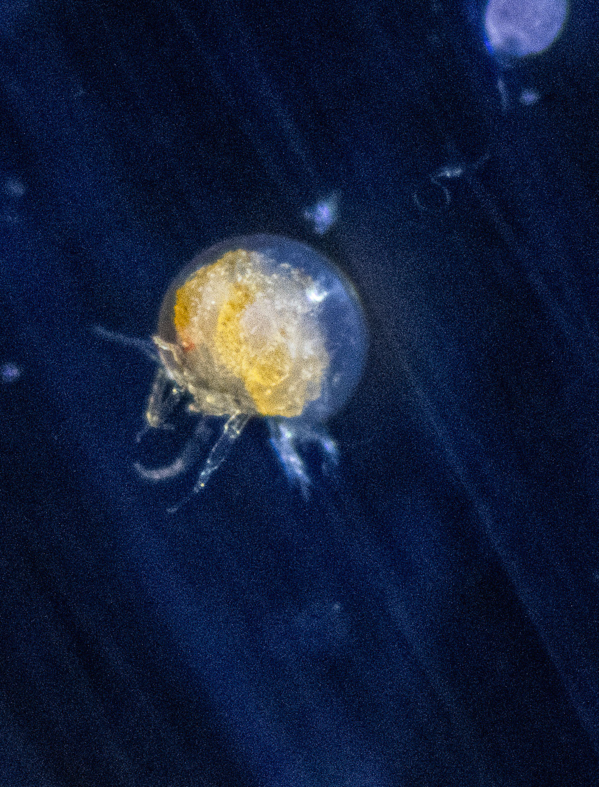
  </a>
  <a href="images/research/nicothoid_fig1a_seq3.jpg" data-fancybox="fig1a-seq">
    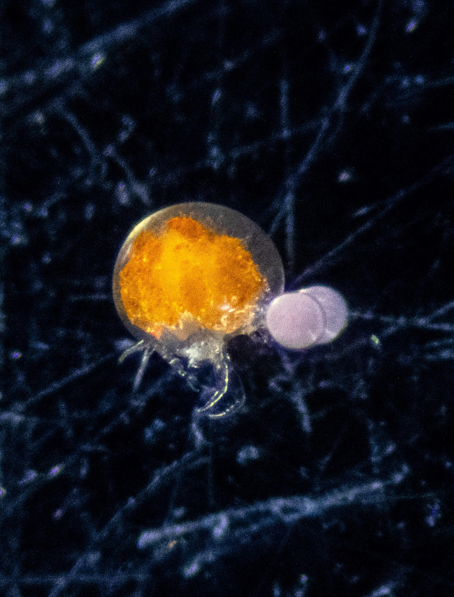
  </a>
  <a href="images/research/nicothoid_fig1a_seq4.jpg" data-fancybox="fig1a-seq">
    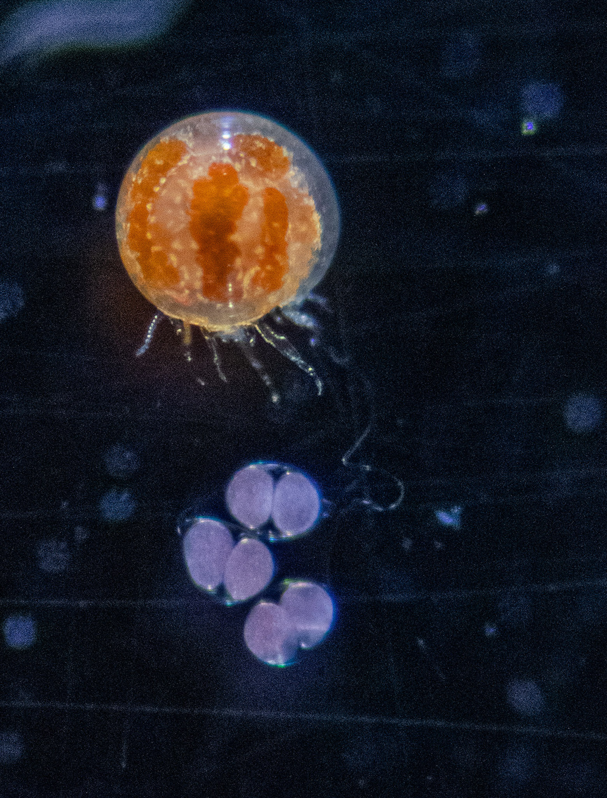
  </a>
  <a href="images/research/nicothoid_fig1a_seq5.jpg" data-fancybox="fig1a-seq">
    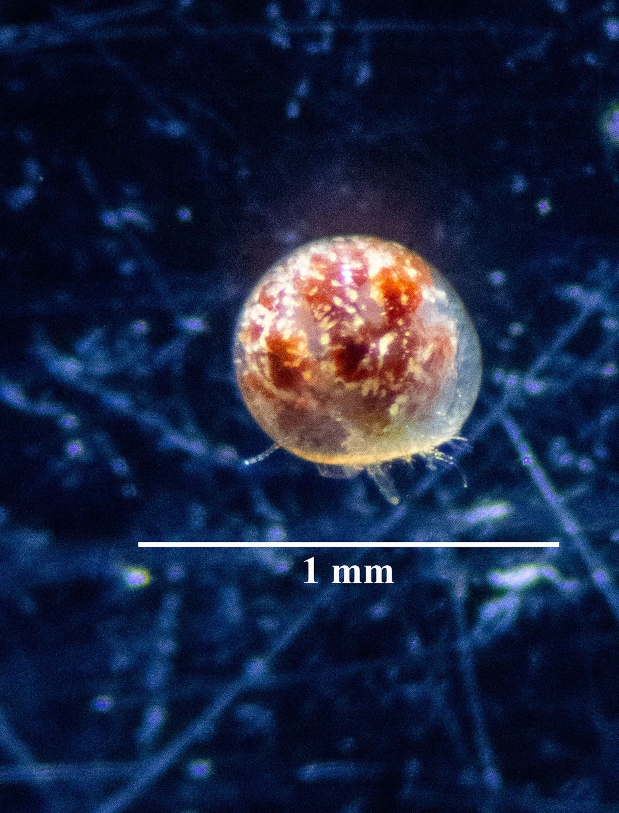
  </a>

<figcaption>1a. Adult females from <em>Metacarcinus anthonyi</em>, in sequence: growth and color change from yellow and orange to maroon as they enlarge and become heavily gravid.</figcaption>
</figure>

<figure>
  <a href="images/research/nicothoid_fig1b.jpg" data-fancybox="kuris-figs">
    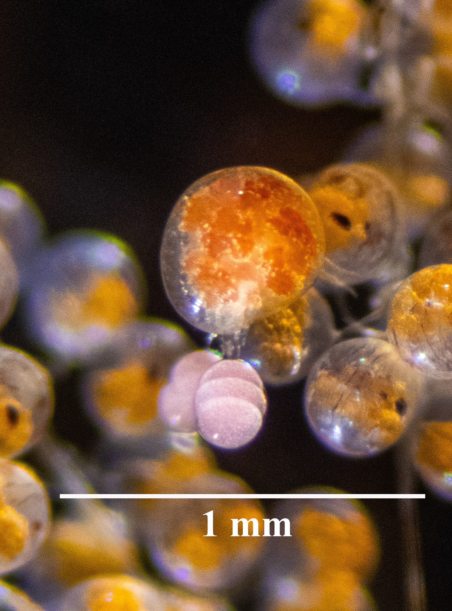
  </a>
  <figcaption>1b. Adults with their pink egg sacs nestled among the host's eggs. Empty capsules mark where embryos have been consumed.</figcaption>
</figure>

<figure>
  <a href="images/research/nicothoid_fig1c.jpg" data-fancybox="kuris-figs">
    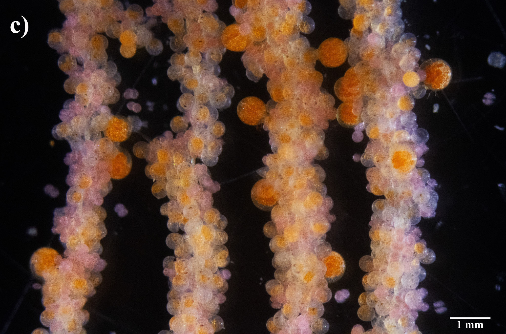
  </a>
  <figcaption>1c. A gravid female carrying multiple egg sacs, tangled among the host's egg fascicles.</figcaption>
</figure>

<figure>

  <a href="images/research/nicothoid_fig1e.jpg" data-fancybox="fig1ef-seq" class="active">
    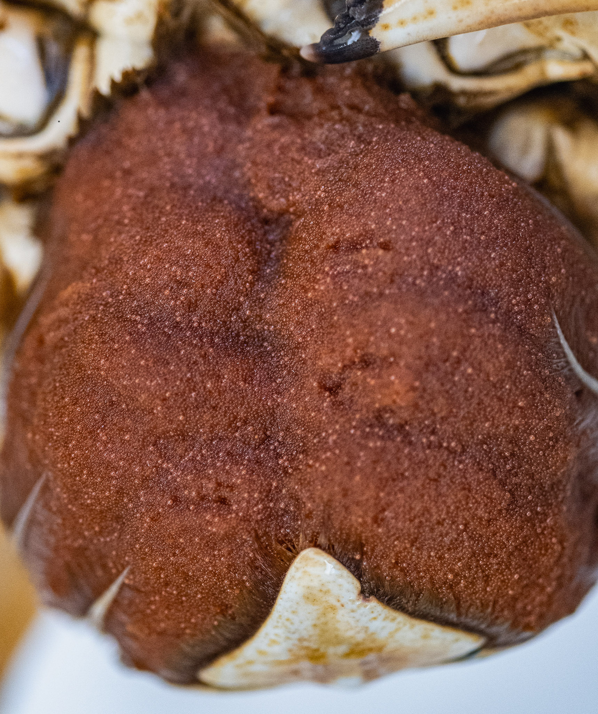
  </a>
  <a href="images/research/nicothoid_fig1f.jpg" data-fancybox="fig1ef-seq">
    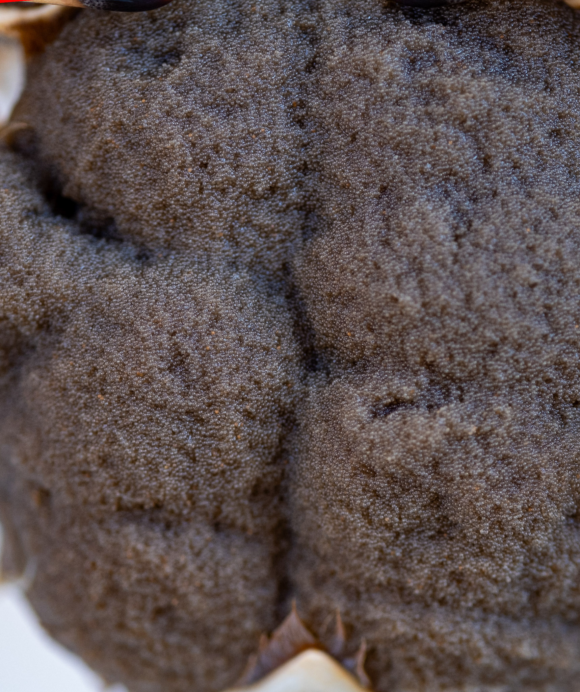
  </a>

<figcaption>1e and 1f. Two broods at a similar developmental stage: one deep maroon under dense nicothoid eggs, the other carrying few parasites.</figcaption>
</figure>

### Figure 2. Larvae, and the gills

<figure>

  <a href="images/research/nicothoid_fig2a.jpg" data-fancybox="fig2-seq" class="active">
    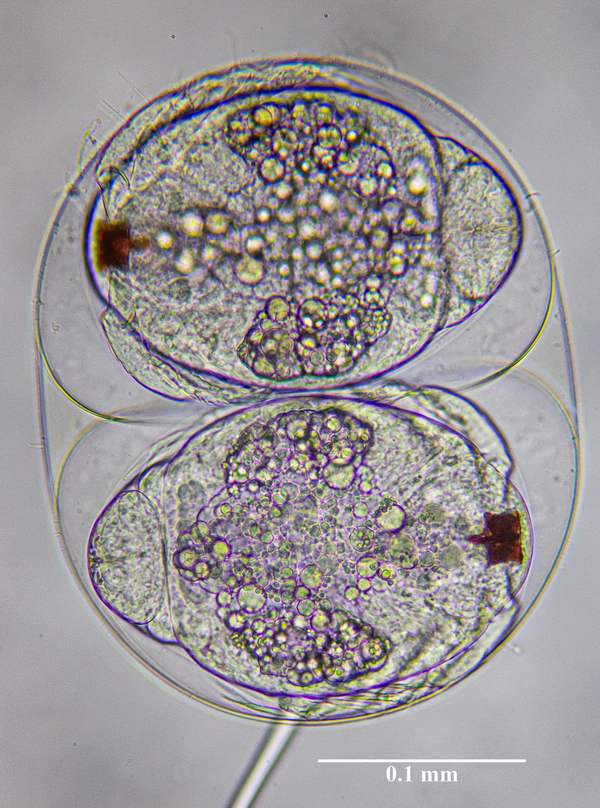
  </a>
  <a href="images/research/nicothoid_fig2b.jpg" data-fancybox="fig2-seq">
    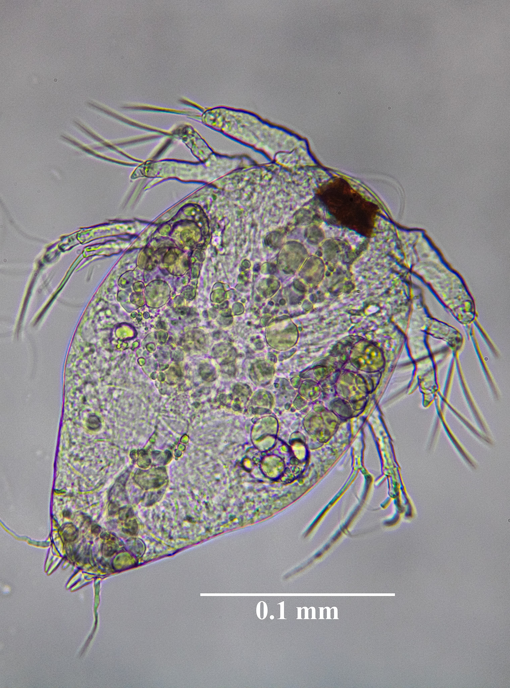
  </a>
  <a href="images/research/nicothoid_fig2c.jpg" data-fancybox="fig2-seq">
    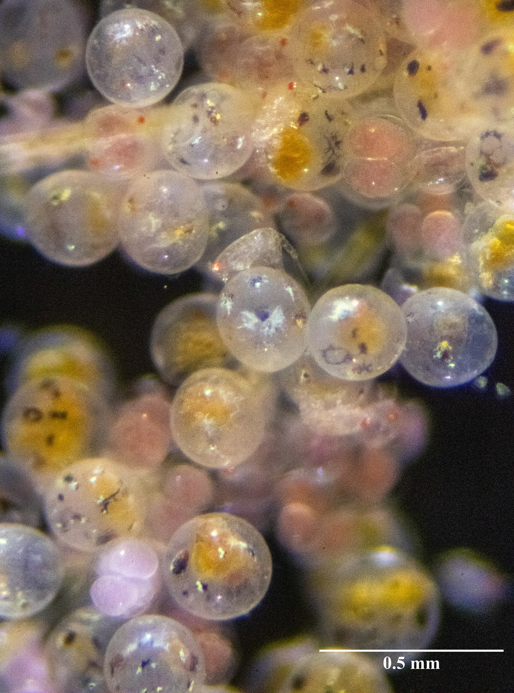
  </a>
  <a href="images/research/nicothoid_fig2d.jpg" data-fancybox="fig2-seq">
    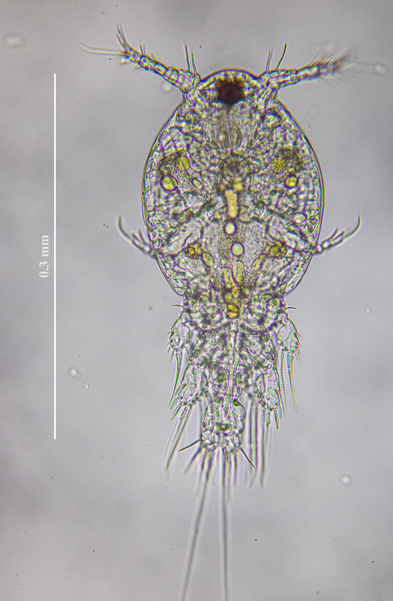
  </a>

<figcaption>2a to 2d. The larval series in order: embryos in egg sacs, nauplii, copepodids on the egg mass, and copepodids attached to excised gills of <em>Metacarcinus anthonyi</em>. The last panel is the one that makes the life cycle close.</figcaption>
</figure>

## Videos

<figure>
  <video controls preload="metadata">
    <source src="videos/Adult_Nicothoid_Video.mp4" type="video/mp4">
    Your browser does not support the video tag.
  </video>
  <figcaption>Adults on the brood. An adult moving among host eggs and feeding, showing egg mimicry and attachment.</figcaption>
</figure>

<figure>
  <video controls preload="metadata">
    <source src="videos/Nicothoid_Gills_Video.mp4" type="video/mp4">
    Your browser does not support the video tag.
  </video>
  <figcaption>Copepodids on gills. Larval stages on the gill lamellae, the microhabitat that carries the parasite between broods.</figcaption>
</figure>

<figure>
  <video controls preload="metadata">
    <source src="videos/Nicothoid_EggMass_Video.mp4" type="video/mp4">
    Your browser does not support the video tag.
  </video>
  <figcaption>A heavy infestation. Dense clusters of adults and egg sacs through a single brood.</figcaption>
</figure>

Higher resolution versions and the raw files are archived in Zenodo, linked at the top of the page.

## Acknowledgments

This project builds on work with the Kuris Lab at the University of California, Santa Barbara, collaborators who helped collect crabs and identify copepods, and the Coastal Fund at the University of California, Santa Barbara (CF-202204-02367), which supported field and laboratory work.

<a class="read-more" href="research.html">Back to Research</a>
<a class="btn btn-primary" href="contact.html">Contact</a>

