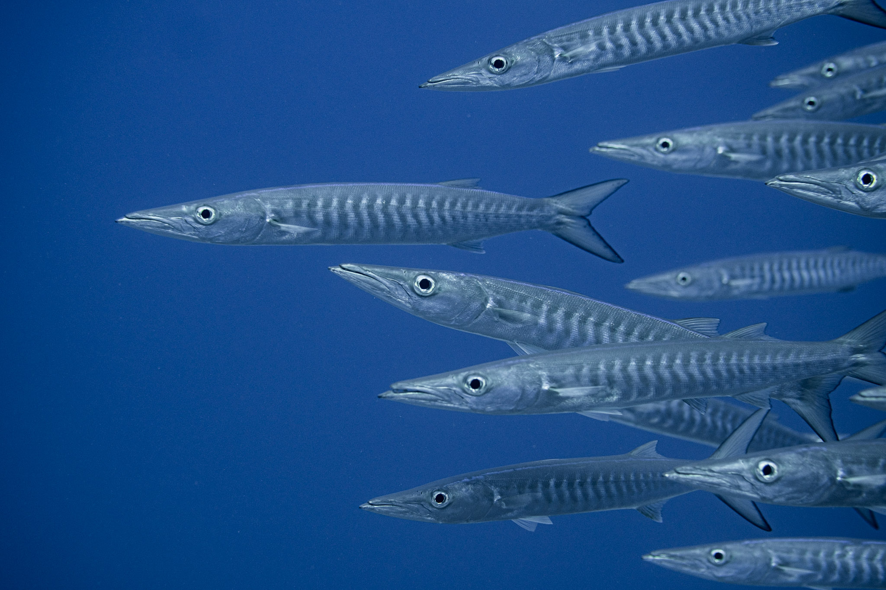
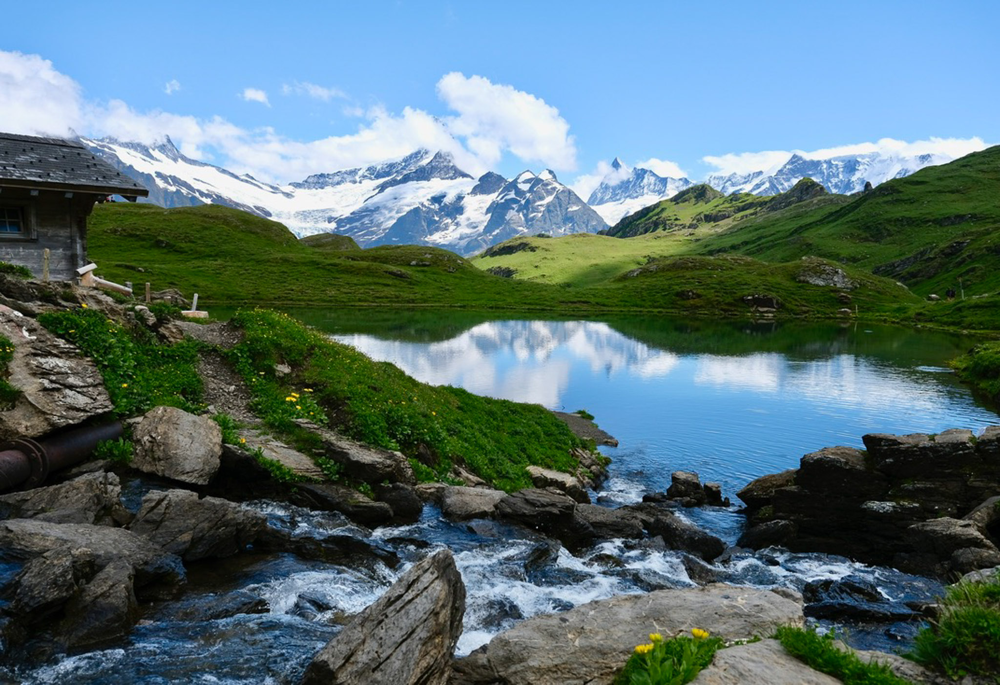

<!-- Page banner with slideshow background -->
<div class="page-banner" role="img" aria-label="Photography banner slideshow">
  <div class="hero-slideshow" id="photo-hero">
  
  <a href="images/banners/photography_1.jpg" data-fancybox="photo-hero" class="active">
    
  </a>
  <a href="images/banners/photography_2.jpg" data-fancybox="photo-hero">
    
  </a>
  <a href="images/banners/photography_3.jpg" data-fancybox="photo-hero">
    
  </a>
  <a href="images/banners/photography_4.jpg" data-fancybox="photo-hero">
    
  </a>
  <a href="images/banners/photography_5.jpg" data-fancybox="photo-hero">
    
  </a>

  </div>
  <div class="page-banner-overlay"></div>
  <div class="page-banner-inner" markdown="1">
# Photography {.page-banner-title}
<p class="page-banner-subtitle">textures • motion • atmosphere</p>
  </div>
</div>

<script>
document.addEventListener('DOMContentLoaded', function () {
  const el = document.getElementById('photo-hero');
  if (!el) return;

  const slides = Array.from(el.querySelectorAll('a'));
  let i = 0;

  function show(n){ slides.forEach((s, idx) => s.classList.toggle('active', idx === n)); }
  function next(){ i = (i + 1) % slides.length; show(i); }

  // Start on first slide
  show(0);

  // Respect reduced motion
  const reduce = window.matchMedia && window.matchMedia('(prefers-reduced-motion: reduce)').matches;
  if (reduce) return;

  // Auto-rotate
  const delay = 3500; // ms per slide
  let timer = setInterval(next, delay);

  // Pause on hover so visitors can click/inspect
  el.addEventListener('mouseenter', () => clearInterval(timer));
  el.addEventListener('mouseleave', () => { timer = setInterval(next, delay); });
});
</script>

```{r setup-utf8, include=FALSE}
# Prefer a UTF-8 locale (silent if not available)
try(Sys.setlocale("LC_CTYPE", "en_US.UTF-8"), silent = TRUE)
options(encoding = "UTF-8")

# Make knitr treat ALL chunk outputs as UTF-8 text
knitr::knit_hooks$set(output = function(x, options) {
  Encoding(x) <- "UTF-8"
  enc2utf8(x)
})
```


```{r, results='asis'}
#load the necessary libraries
library(here)
library(tidyverse)
library(fs)
library(glue)

#load the necessary functions 
source("scripts/render_gallery.R")
source("scripts/generate_metadata.R")

```


```{r, results='asis'}
#generate metadata fro the terrestrial category of images
#generate_metadata(category = "terrestrial")

#generate metadata fro the marine category of images
#generate_metadata(category = "marine")

#generate metadata fro the portraits category of images
#generate_metadata(category = "portraits")

```


::: {.section-title-box}
# Marine Photography
:::
<div class="section-spacer"></div>

```{r, results='asis'}
#create a gallery of marine images
render_gallery(category = "marine",
               metadata_file = "data/marine_metadata.csv",
               path_prefix = "images")

```


::: {.section-title-box}
# Terrestrial Photography 
:::
<div class="section-spacer"></div>

```{r, results='asis'}
#create a gallery of terrestrial images
render_gallery(category = "terrestrial",
               metadata_file  = "data/terrestrial_metadata.csv",
               path_prefix = "images")

```


::: {.section-title-box}
# Portraits 
:::
<div class="section-spacer"></div>

```{r, results='asis'}
#create a gallery of portraits 
render_gallery(category = "portraits",
               metadata_file  = "data/portraits_metadata.csv",
               path_prefix = "images")

```

<div class="gallery-footer">
  <a class="btn btn-primary" href="contact.html">Contact</a>
  <a class="read-more" href="#">Back to top</a>
</div>

<!-- Lightweight client-side randomizer.
     Shuffles each .masonry gallery on page load so you don't
     have to rebuild large shuffled HTML. Set MODE to 'daily'
     to keep a stable order per day. -->
<script>
  (function () {
    function mulberry32(a) {
      return function () {
        var t = a += 0x6D2B79F5;
        t = Math.imul(t ^ (t >>> 15), t | 1);
        t ^= t + Math.imul(t ^ (t >>> 7), t | 61);
        return ((t ^ (t >>> 14)) >>> 0) / 4294967296;
      };
    }

  const MODE = 'always'; // 'always' | 'daily'

  function shuffleNodes(container, mode) {
    const items = Array.from(container.children);
    if (items.length < 2) return;

  let rand = Math.random;
    if (mode === 'daily') {
        const day = new Date().toISOString().slice(0, 10); // YYYY-MM-DD
        let seed = 2166136261;
        for (let i = 0; i < day.length; i++) {
          seed ^= day.charCodeAt(i);
          seed = Math.imul(seed, 16777619);
        }
        rand = mulberry32(seed >>> 0);
      }

  // Fisher–Yates shuffle
      for (let i = items.length - 1; i > 0; i--) {
        const j = Math.floor(rand() * (i + 1));
        [items[i], items[j]] = [items[j], items[i]];
      }

  const frag = document.createDocumentFragment();
      items.forEach(n => frag.appendChild(n));
      container.appendChild(frag);
    }

  function init() {
      document
        .querySelectorAll('.masonry')
        .forEach(g => shuffleNodes(g, MODE));
    }

  if (document.readyState === 'loading') {
      document.addEventListener('DOMContentLoaded', init);
    } else {
      init();
    }
  })();
</script>
