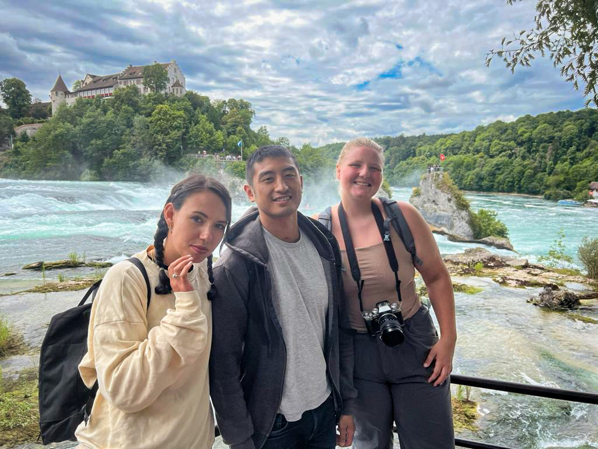

<!-- Page banner with slideshow background -->
<div class="page-banner" role="img" aria-label="Photography banner slideshow">
  <div class="hero-slideshow" id="photo-hero" data-delay="3500">
  
  <a href="images/banners/photography_1.jpg" data-fancybox="photo-hero" class="active">
    
  </a>
  <a href="images/banners/photography_2.jpg" data-fancybox="photo-hero">
    
  </a>
  <a href="images/banners/photography_3.jpg" data-fancybox="photo-hero">
    
  </a>
  <a href="images/banners/photography_4.jpg" data-fancybox="photo-hero">
    
  </a>
  <a href="images/banners/photography_5.jpg" data-fancybox="photo-hero">
    
  </a>

  </div>
  <div class="page-banner-overlay"></div>
  <div class="page-banner-inner" markdown="1">
  
# Photography {.page-banner-title}
<p class="page-banner-subtitle">wildlife • portraits • microscopy</p>
  </div>
</div>

<!-- REMOVED: the inline slideshow script block.
     scripts/site.js initialises every .hero-slideshow on the site, so this
     page-level copy was a second timer toggling the same "active" class as
     site.js's. Two timers on one slideshow is why the fade advanced
     unevenly, and the mouseenter pause only ever cleared one of them.
     Per-slide speed is now carried by data-delay on the element itself. -->

```{r setup-utf8, include=FALSE}
# Prefer a UTF-8 locale (silent if not available)
try(Sys.setlocale("LC_CTYPE", "en_US.UTF-8"), silent = TRUE)
options(encoding = "UTF-8")

# Make knitr treat ALL chunk outputs as UTF-8 text
knitr::knit_hooks$set(output = function(x, options) {
  Encoding(x) <- "UTF-8"
  enc2utf8(x)
})
```


```{r, results='asis'}
#load the necessary libraries
library(here)
library(tidyverse)
library(fs)
library(glue)

#load the necessary functions 
source("scripts/render_gallery.R")
source("scripts/generate_metadata.R")

```


<div class="gallery-section">
<div class="gallery-mini-hero">
<video class="gallery-mini-hero-video"
autoplay muted loop playsinline>
<source src="videos/marine.mp4" type="video/mp4">
</video>
<div class="gallery-mini-hero-overlay">
<a class="gallery-mini-hero-title" href="photography-marine.html">
Marine Photography
</a>
</div>
</div>

<div class="gallery-summary">
<div class="gallery-blurb">
Most of this is from diving in the tropics: the Great Barrier Reef, Komodo, Raja Ampat, the Philippines, Thailand, Revillagigedo, and Protea Banks. I shoot both ends of the scale and not much in between. Wide for the animals that come to you, like grey reef sharks, oceanic mantas, humpbacks, and the occasional sand tiger cruising a wall. Macro for the ones that stay put, like leaf scorpionfish, ghost pipefish, mantis shrimp, and whatever is sitting in the sand pretending to be sand. The reef animals are usually easier subjects than the big ones, because they have already decided you are not worth reacting to, which means you can take your time and get the light right. The big animals give you one pass, maybe two, and you either had the camera ready or you did not.
</div>

<p class="gallery-summary-actions">
<a class="btn btn-primary" href="photography-marine.html">View Full Gallery</a>
</p>
</div>

</div>


<div class="gallery-section">
<div class="gallery-mini-hero">
<video class="gallery-mini-hero-video"
autoplay muted loop playsinline>
<source src="videos/terrestrial.mp4" type="video/mp4">
</video>
<div class="gallery-mini-hero-overlay">
<a class="gallery-mini-hero-title" href="photography-terrestrial.html">
Terrestrial Photography
</a>
</div>
</div>

<div class="gallery-summary">
<div class="gallery-blurb">
Two things dominate this gallery: African wildlife and European cities. The wildlife is mostly from Kenya and Botswana, in the Maasai Mara, Amboseli, and the Okavango Delta, where the work is largely about waiting and about light that only lasts twenty minutes at either end of the day. The cities are Venice, Cinque Terre, Budapest, Paris, and a long stretch of Switzerland, where I am usually photographing shape and weather rather than landmarks, and where the interesting frame is often the one behind you. The rest is Thailand, the Philippines, and a handful of days closer to home in California. Different subjects entirely, but the same instinct behind all of them, which is to photograph something in the moment before it rearranges itself into something ordinary.
</div>

<p class="gallery-summary-actions">
<a class="btn btn-primary" href="photography-terrestrial.html">View Full Gallery</a>
</p>
</div>

</div>


<div class="gallery-section">
<div class="gallery-mini-hero">

<div class="gallery-mini-hero-overlay">
<a class="gallery-mini-hero-title" href="photography-portraits.html">
Portraits
</a>
</div>
</div>

<div class="gallery-summary">
<div class="gallery-blurb">
A lot of this is graduation photos, taken around UCSB in May 2025 for friends who were finishing at the same time I was. Those are posed, and posed on purpose, because that is what the picture is for. The point was to make something people would actually want, in the places where they had spent four years. The rest of the gallery is looser: days out at Bishop, the Gaviota wind caves, the Douglas Family Preserve, Coal Oil Point, and a handful from Capri, Dubrovnik, Kaua'i, and the Okavango. The same faces turn up over and over across both kinds, which is the honest summary of who I was around. I am not a portrait photographer by training, but I keep taking them, and I am glad to have this many from a year when everyone was still in one place.
</div>

<p class="gallery-summary-actions">
<a class="btn btn-primary" href="photography-portraits.html">View Full Gallery</a>
</p>
</div>
</div>


<div class="gallery-section">
<div class="gallery-mini-hero">
<video class="gallery-mini-hero-video"
autoplay muted loop playsinline>
<source src="videos/microscopy.mp4" type="video/mp4">
</video>
<div class="gallery-mini-hero-overlay">
<a class="gallery-mini-hero-title" href="photography-microscopy.html">
Microscopy
</a>
</div>
</div>

<div class="gallery-summary">
<div class="gallery-blurb">
This is almost entirely nudibranchs and sea slugs, shot in Santa Barbara and Mo'orea. Opalescent nudibranchs, *Dendrodoris*, *Elysia*, blue ring sea hares, and a few things I am still not certain about. There are also fire worms, brooding anemones, *Cladonema* jellyfish, and the parasitic copepod I ended up describing in a paper. Under a scope these animals stop being specks and turn into something structured and frankly ridiculous. A nudibranch's cerata look engineered. A copepod that reads as an orange dot by eye has legs, eyespots, and egg sacs, and spends its whole adult life on a crab's eggs pretending to be one of them. Most of these were shot while I was supposed to be doing something else, which is usually when the good ones happen.
</div>

<p class="gallery-summary-actions">
<a class="btn btn-primary" href="photography-microscopy.html">View Full Gallery</a>
</p>
</div>

</div>

<div class="gallery-footer">
  <a class="btn btn-primary" href="contact.html">Contact</a>
  <a class="read-more" href="#">Back to top</a>
</div>


