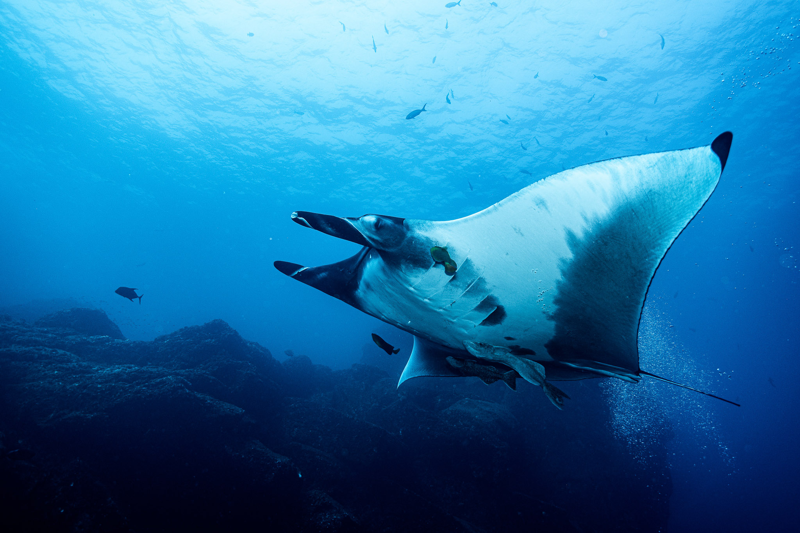
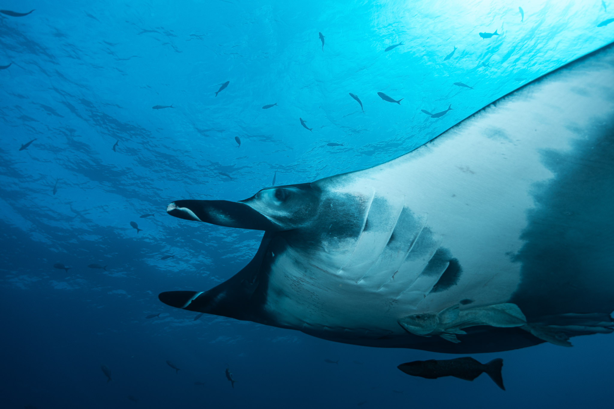
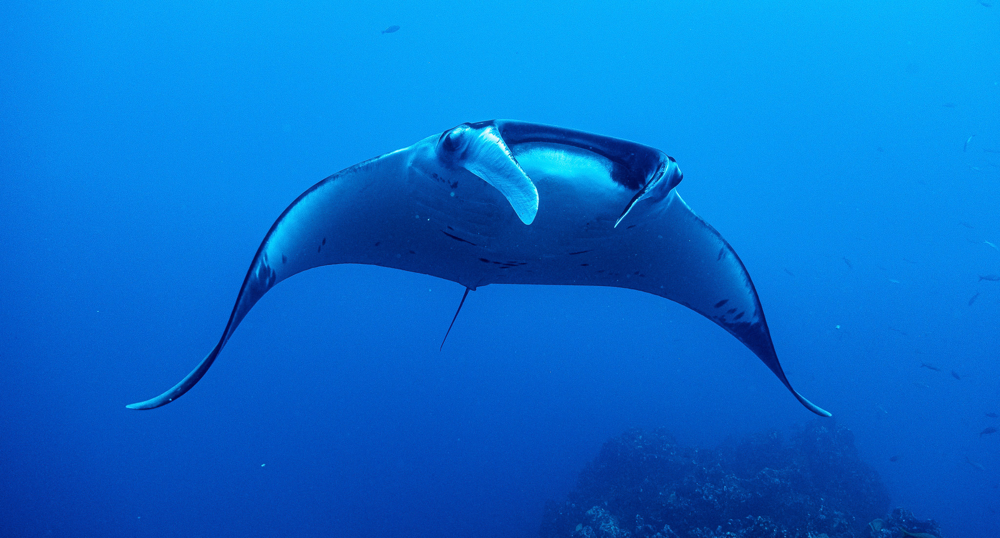

<!-- Hero slideshow. Styles from section 17 of styles.css, timer from
     scripts/site.js, which initialises every .hero-slideshow on the site.
     Per-slide speed is carried by data-delay on the element itself. -->

  
  
  
  

## Overview

Every oceanic manta carries a pattern of spots on its underside, and that pattern does not change over the animal's life. Photograph it well enough and you have identified an individual, not a species: the same animal can be recognized years later, at another site, by another diver who has never seen it before.

That turns every diver with a camera into a potential data point. The Pacific Manta Research Group studies oceanic mantas of the Eastern Pacific, focused on the Revillagigedo Archipelago with collaborations in the Gulf of California and Bahía de Banderas, and it combines images submitted by divers with researcher-led tagging and field work to follow individuals, demography, movement and injury histories.[^about]

The catch is that most photographs are not usable. A picture that shows the animal but not its underside, or shows the underside at an angle, or arrives with no date or site attached, cannot enter a catalog. My work was on that gap: the public website and the submission pathway, so that what a diver sends is something the catalog can actually accept.[^submit]

The Program

Have photographs to send?

Submissions from divers are the bulk of what the catalog is built from. The guidance page carries the folder and filename conventions, the contributor agreement and the upload options.

<a class="cite-chip" href="https://pacificmantaresearchgroup.org/submit-photos/" target="_blank" rel="noopener"><i class="bi bi-camera" aria-hidden="true"></i>Submit Photos</a>
<a class="cite-chip" href="https://pacificmantaresearchgroup.org/about/" target="_blank" rel="noopener"><i class="bi bi-info-circle" aria-hidden="true"></i>About the Program</a>

## Quick Facts

- **Role:** Website and photo identification support, Pacific Manta Research Group
- **When:** 2021 to 2024
- **Where:** Revillagigedo Archipelago, with collaborations in the Gulf of California and Bahía de Banderas
- **Skills:** content design, contributor guides, photo identification catalog support, metadata standards, outreach

## Background and Questions

- How can high quality, diver-submitted images be scaled into a catalog that supports reliable re-sighting of individual animals?
- Which regions and seasons yield the most re-sightings around Revillagigedo, and what can injury and scar records say about the threats those animals face?

## What Makes a Photograph Usable

The whole pipeline rests on one thing: whether an image can be matched against a catalog. Four requirements do most of the work, and each one fails in a predictable way.

::: {.table-card}

| Requirement | Why it matters | How it usually fails |
|---|---|---|
| The underside, square on | The spot pattern is the identity | Shot from the side or above, so the pattern is foreshortened |
| Pelvic fins in frame | They give the animal's sex | Cropped out to fill the frame with the body |
| Contrast on the pattern | A matcher has to see spot edges | Backlit, or a black morph shot without flash |
| Date, site and photographer | An image without them is a picture, not a record | No metadata, or a timestamp burned into the image itself |

:::

**Where the guidance lives.** Contributor instructions are written to be read on a boat, not at a desk: the shot to aim for, worked visual examples of good and unusable frames, and a questions page for everything else. Submissions come in by small batch form or bulk transfer, with set folder and filename conventions so an image arrives already labeled.

**Data hygiene.** Date, time and location are required. Timestamps burned into the image are discouraged, because they sit on top of the animal and cannot be corrected later, while the camera's embedded metadata is retained wherever possible and carries the same information without damaging the photograph.

**Black morphs need flash.** A dark animal photographed on available light comes back as a silhouette, and a silhouette has no spot pattern. Close range with flash is the difference between a record and a nice picture. Video helps too: a turning animal that never presents its underside squarely in a still can often be reconstructed from a few frames.

## Status

This was contribution to a long-running program rather than a project of mine, and the catalog, the re-sighting histories and anything drawn from them belong to the Pacific Manta Research Group. Both links above go to the live pages.

## Acknowledgments

The Pacific Manta Research Group team and its collaborators, and the participating dive boats and photographers whose images the catalog is built from.

<a class="read-more" href="research.html">Back to Research</a>
<a class="btn btn-primary" href="contact.html">Contact</a>

[^about]: Pacific Manta Research Group, *About*. <https://pacificmantaresearchgroup.org/about/>

[^submit]: Pacific Manta Research Group, *Submit Photos*: contributor guidance, metadata and upload options. <https://pacificmantaresearchgroup.org/submit-photos/>
