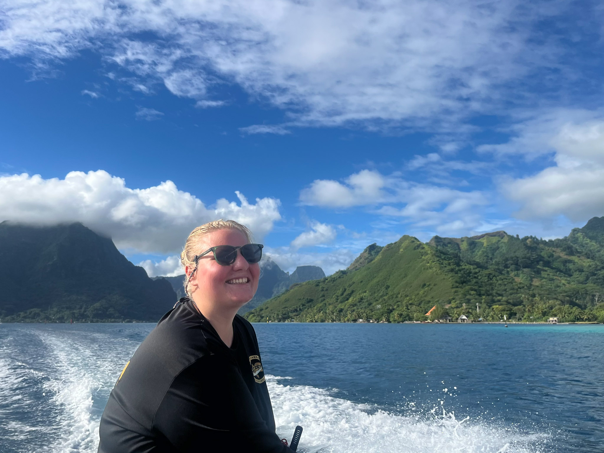
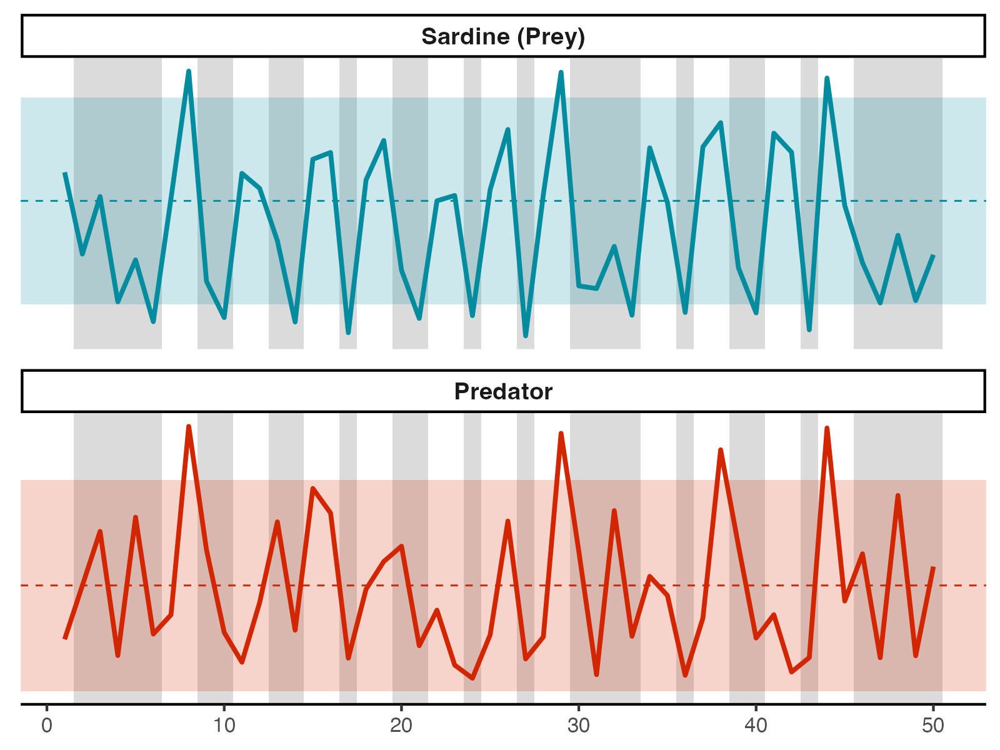
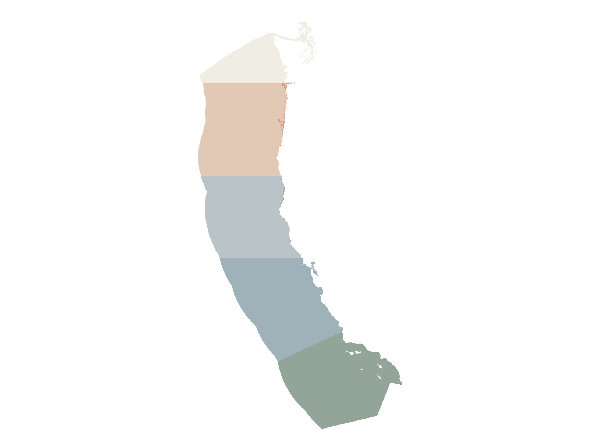
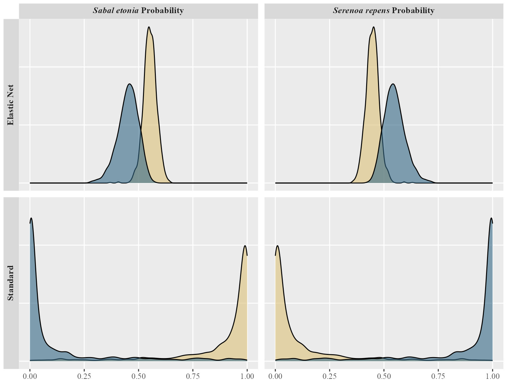
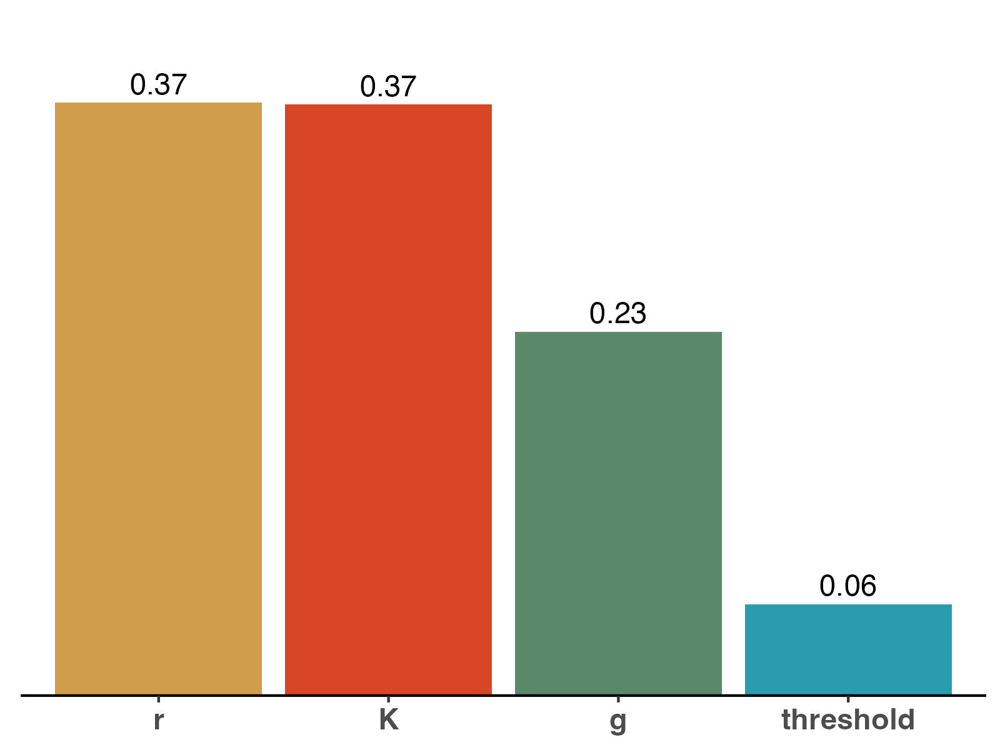
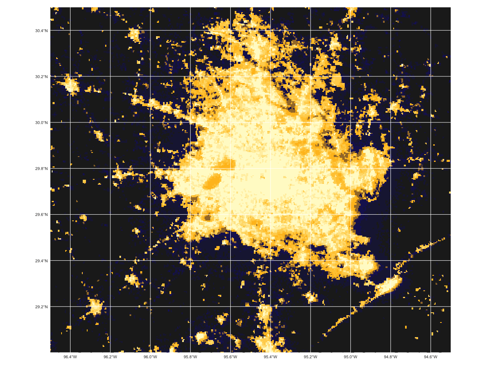
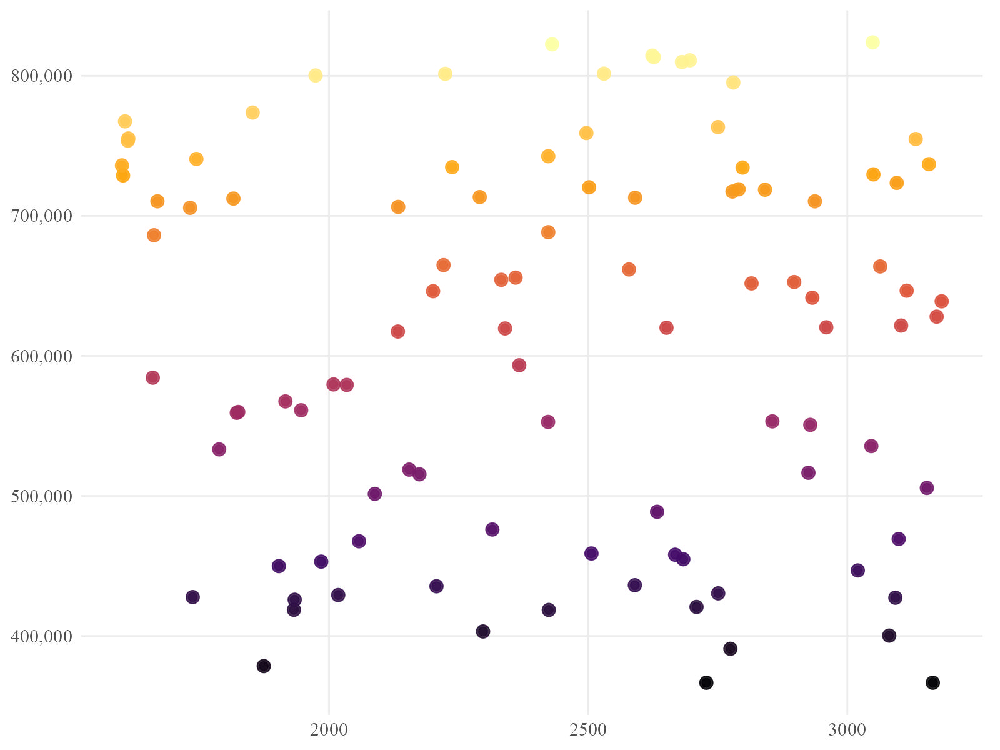

<div class="page-banner" role="img" aria-label="Underwater research banner video">
  <video autoplay muted loop playsinline preload="metadata">
    <source src="images/banners/research.mp4" type="video/mp4">
  </video>
  <div class="page-banner-overlay"></div>
  <div class="page-banner-inner">

# Research {.page-banner-title}

<p class="page-banner-subtitle">fieldwork • models • communication</p>
  </div>
</div>

I'm a marine ecologist working on the **population dynamics of harvested species** and the habitats that support them. My work spans **stage-structured modeling** of California spiny lobster under Marine Protected Area and slot-limit scenarios, **fishery-independent surveys** across long-term California monitoring programs, and **experimental coral biology**. I'm most interested in making monitoring data more useful for stock assessment and spatial management.

<p class="links">
  <a class="read-more pdf-chip" href="#publications"><i class="bi bi-journal-text" aria-hidden="true"></i>Publications</a>
  <a class="read-more pdf-chip" href="https://orcid.org/0009-0006-8419-6937" target="_blank" rel="noopener"><i class="bi bi-person-badge" aria-hidden="true"></i>ORCID</a>
  <a class="read-more pdf-chip" href="https://scholar.google.com/citations?user=nZCmgAOvTQIC&amp;hl=en" target="_blank" rel="noopener"><i class="bi bi-mortarboard" aria-hidden="true"></i>Google Scholar</a>
</p>

<div class="section-band" id="projects">
  <div class="band-inner">

## Research Projects

<div class="grid grid-two">

<!-- CARD — Lobster model -->
<div class="card" role="article" aria-labelledby="card-lobster-title">
  <a data-fancybox="lobster"
     href="images/research/stier_lobster.jpg"
     data-caption="Slot limits × MPAs: California spiny lobster modeling (Stier Lab, UCSB)">
    
  </a>
  <h4 id="card-lobster-title">Slot Limits and MPAs: California Spiny Lobster (<em>Panulirus interruptus</em>)</h4>
  <div class="meta">Stier Lab, UCSB · Sep 2024 – present</div>
  <p>Spatially explicit, female-only stage-structured model across CDFW fishing blocks, asking how
     many large females the fishery actually lands and whether current assessment methods could
     detect them. Groundwork for quantifying the ecological value of protecting large individuals.</p>
  <p class="links">
    <a class="btn" href="https://github.com/jadenorli" target="_blank" rel="noopener">Code</a>
    <a class="btn btn-primary" href="lobster-model.html" aria-label="Read more about the spiny lobster modeling project">Read Me</a>
  </p>
</div>

<!-- CARD — Mo'orea coral -->
<div class="card" role="article" aria-labelledby="card-coral-title">
  <a data-fancybox="coral"
     href="images/research/moorea_coral.jpg"
     data-caption="Genotyped Porites cores — wound regeneration experiment, Mo'orea">
    
  </a>
  <h4 id="card-coral-title">Coral Wound Regeneration: Mo'orea (French Polynesia) <em>Porites</em></h4>
  <div class="meta">Stier Lab, UCSB · May 2026 – present</div>
  <p>Island-wide <em>Porites</em> genotyping survey assigning colonies to mitochondrial lineages,
     plus a 2×2 factorial experiment testing whether secondary wounding (microwounding) and algae removal reactivate
     stalled tissue regeneration in corals whose recovery has stalled mid-healing.</p>
  <p class="links">
    <a class="btn" href="https://github.com/jadenorli" target="_blank" rel="noopener">Code</a>
    <a class="btn btn-primary" href="coral-regeneration.html" aria-label="Read more about the Mo'orea coral regeneration experiment">Read Me</a>
  </p>
</div>

<!-- CARD — Nicothoid copepod -->
<div class="card" role="article" aria-labelledby="card-kuris-title">
  <a data-fancybox="kuris" href="images/research/kuris_crab.jpg">
    
  </a>
  <h4 id="card-kuris-title">Nicothoid (<em>Choniosphaera</em> sp.) Copepod Parasite: Cancrid Crabs</h4>
  <div class="meta">Kuris Lab, UCSB · Sep 2021 – Mar 2026</div>
  <p>First record of a nicothoid egg predator (<em>Choniosphaera</em> sp.) infesting cancrid crabs anywhere in the Eastern
     Pacific, combining aquarium rearing of ovigerous hosts with brood stage intensity modeling to
     estimate its threat to a data poor rock crab fishery. Published in <em>Ecology</em> (2025).
     <a class="read-more pdf-chip" href="files/orli_2025_ecology.pdf" download><i class="bi bi-download" aria-hidden="true"></i>PDF</a></p>
  <p class="links">
    <a class="btn btn-primary" href="nicothoid-copepod.html">Read Me</a>
  </p>
</div>

<!-- CARD — Valentine Lab sediment and seeps -->
<div class="card" role="article" aria-labelledby="card-microbes-title">
  <a data-fancybox="valentine" href="images/research/sediment_and_seeps.jpg">
    
  </a>
  <h4 id="card-microbes-title">Sediment and Seeps: San Pedro Basin and Coal Oil Point (Southern California)</h4>
  <div class="meta">Valentine Lab, UCSB · Jan 2023 – Aug 2025</div>
  <p>Two strands on what reaches the floor of the Southern California Bight: sediment coring over the
     San Pedro Basin DDT disposal site, feeding a published waste inventory in <em>Environmental Science
     and Technology</em> (2025), and a Coastal Fund project on whether the ocean's own alkane cycle primes microbes to absorb
     petroleum.
     <a class="read-more pdf-chip" href="files/wu_2025_acs.pdf" download><i class="bi bi-download" aria-hidden="true"></i>PDF</a></p>
  <p class="links">
    <a class="btn btn-primary" href="sediment-and-seeps.html" aria-label="Read more about the San Pedro Basin and Coal Oil Point work">Read Me</a>
  </p>
</div>

</div>
  </div>
</div>

<div class="section-band" id="analyses">
  <div class="band-inner">

## Field and Monitoring Programs

<div class="grid">

<!-- CARD — SONGS -->
<div class="card" role="article" aria-labelledby="card-songs-title">
  <a data-fancybox="songs" href="images/research/songs_1.jpg">
    
  </a>
  <h4 id="card-songs-title">SONGS: Salt Marsh Mitigation Monitoring</h4>
  <div class="meta">MSI, UCSB · Aug 2025 – Jan 2026</div>
  <p>Salt marsh fish and invertebrate monitoring at Carpinteria Salt Marsh Reserve and Point Mugu
     Lagoon, using seine and trap surveys, species identification to lowest practical taxon, and
     laboratory processing supporting long term restoration reporting.</p>
  <p class="links">
    <a class="btn" href="files/songs_report_2025.pdf" download>Report</a>
    <a class="btn btn-primary" href="songs.html" aria-label="Read more about SONGS">Read Me</a>
  </p>
</div>

<!-- CARD — PISCO / kelp forest -->
<div class="card" role="article" aria-labelledby="card-pisco-title">
  <a data-fancybox="pisco" href="images/research/caselle_pisco.jpg">
    
  </a>
  <h4 id="card-pisco-title">PISCO: Kelp Forest Monitoring</h4>
  <div class="meta">Caselle Lab, UCSB · Jun – Oct 2024</div>
  <p>Standardized underwater benthic and fish visual surveys across Northern Channel Islands marine
     protected areas for the Partnership for Interdisciplinary Studies of Coastal Oceans, tracking
     how protected reefs differ from fished ones.</p>
  <p class="links">
    <a class="btn btn-primary" href="kelp-forest-monitoring.html#kelp-forest-surveys">Read Me</a>
  </p>
</div>

<!-- CARD — CCFRP -->
<div class="card" role="article" aria-labelledby="card-ccfrp-title">
  <a data-fancybox="ccfrp" href="images/research/ccfrp.jpg">
    
  </a>
  <h4 id="card-ccfrp-title">CCFRP: Collaborative Fisheries Research</h4>
  <div class="meta">Caselle Lab, UCSB · 2024</div>
  <p>Fishery independent hook and line surveys with volunteer anglers through the California
     Collaborative Fisheries Research Program, evaluating nearshore fish stocks inside marine
     protected areas and at paired sites open to fishing.</p>
  <p class="links">
    <a class="btn btn-primary" href="kelp-forest-monitoring.html#nearshore-fisheries-monitoring">Read Me</a>
  </p>
</div>

</div>
  </div>
</div>

<div class="section-band" id="outreach">
  <div class="band-inner">


## Open-Source Analyses

<div class="grid">

<!-- ANALYSIS 1 — Sardine harvest scenarios (EDS 230 HW6) -->
<div class="card card-mini" role="article" aria-labelledby="card-sardine-title">
  <a data-fancybox="sardine" href="images/research/analysis_sardine.jpg">
    
  </a>
  <h4 id="card-sardine-title">Ecosystem Stability: Sardine Harvest Regimes</h4>
  <details class="mini-details">
    <summary>Methods and Summary</summary>
    <div class="meta">EDS 230: Environmental Modeling · R · Lotka-Volterra · Sobol · LHS</div>
    <p>Pacific sardine and predator dynamics under three harvest rules: proportional harvest,
       biomass closure threshold, and adaptive management, with a Sobol analysis separating
       ecological from management drivers.</p>
  </details>
  <p class="links">
    <a class="btn" href="https://github.com/jadenorli/eds-230-hw6" target="_blank" rel="noopener">Repo</a>
    <a class="btn btn-primary" href="https://jadenorli.github.io/eds-230-hw6/code/EDS_230_HW6.html" target="_blank" rel="noopener">Live Analysis</a>
  </p>
</div>

<!-- ANALYSIS 2 — IMTA siting -->
<div class="card card-mini" role="article" aria-labelledby="card-imta-title">
  <a data-fancybox="imta" href="images/research/analysis_imta.jpg">
    
  </a>
  <h4 id="card-imta-title">Marine Aquaculture: Integrative Multi-Trophic Aquaculture</h4>
  <details class="mini-details">
    <summary>Methods and Summary</summary>
    <div class="meta">R · NOAA Coral Reef Watch SST · GEBCO · VLIZ EEZ · FishBase</div>
    <p>Mapping candidate integrated multi trophic aquaculture areas across the U.S. West Coast
       Exclusive Economic Zone from sea surface temperature, bathymetry, and species thermal and
       depth tolerances.</p>
  </details>
  <p class="links">
    <a class="btn" href="https://github.com/jadenorli/marine-aquaculture" target="_blank" rel="noopener">Repo</a>
    <a class="btn btn-primary" href="https://jadenorli.github.io/marine-aquaculture/code/marine_aquaculture.html" target="_blank" rel="noopener">Live Analysis</a>
  </p>
</div>

<!-- ANALYSIS 3 — Palmetto classification -->
<div class="card card-mini" role="article" aria-labelledby="card-palmetto-title">
  <a data-fancybox="palmetto" href="images/research/analysis_palmetto.jpg">
    
  </a>
  <h4 id="card-palmetto-title">Palmetto Species: Binary Classification</h4>
  <details class="mini-details">
    <summary>Methods and Summary</summary>
    <div class="meta">Independent analysis · R · tidymodels · elastic net · 10-fold CV</div>
    <p>Binary logistic regression distinguishing two Florida palmetto species from morphology,
       comparing standard and regularised models on accuracy, ROC AUC, and calibration across ten
       fold cross validation.</p>
  </details>
  <p class="links">
    <a class="btn" href="https://github.com/jadenorli/palmetto-species" target="_blank" rel="noopener">Repo</a>
    <a class="btn btn-primary" href="https://jadenorli.github.io/palmetto-species/code/palmetto-regression.html" target="_blank" rel="noopener">Live Analysis</a>
  </p>
</div>

<!-- ANALYSIS 4 — Forest carbon (EDS 230 HW5) -->
<div class="card card-mini" role="article" aria-labelledby="card-forest-title">
  <a data-fancybox="forest" href="images/research/analysis_forest.jpg">
    
  </a>
  <h4 id="card-forest-title">Forest Carbon: Parameter Uncertainty</h4>
  <details class="mini-details">
    <summary>Methods and Summary</summary>
    <div class="meta">EDS 230: Environmental Modeling · R · deSolve · Sobol</div>
    <p>Threshold based forest growth as a piecewise ordinary differential equation, with variance
       based sensitivity analysis identifying which parameters drive maximum carbon stock under
       uncertainty.</p>
  </details>
  <p class="links">
    <a class="btn" href="https://github.com/jadenorli/eds-230-hw5" target="_blank" rel="noopener">Repo</a>
    <a class="btn btn-primary" href="https://jadenorli.github.io/eds-230-hw5/code/EDS_230_HW5.html" target="_blank" rel="noopener">Live Analysis</a>
  </p>
</div>

<!-- ANALYSIS 5 — Houston blackouts -->
<div class="card card-mini" role="article" aria-labelledby="card-houston-title">
  <a data-fancybox="houston" href="images/research/houston_nightlights.gif">
    
  </a>
  <h4 id="card-houston-title">Extreme Houston Winter Storms: Texas Freeze 2021</h4>
  <details class="mini-details">
    <summary>Methods and Summary</summary>
    <div class="meta">R · VIIRS night-lights · OpenStreetMap · ACS 2019</div>
    <p>Detecting blackout extent from night lights imagery and joining tract level census data to
       quantify socioeconomic disparities in how quickly different Houston neighbourhoods regained
       power.</p>
  </details>
  <p class="links">
    <a class="btn" href="https://github.com/jadenorli/houston-storms" target="_blank" rel="noopener">Repo</a>
    <a class="btn btn-primary" href="https://jadenorli.github.io/houston-storms/code/houston_extreme_storms.html" target="_blank" rel="noopener">Live Analysis</a>
  </p>
</div>

<!-- ANALYSIS 6 — Almond profit (EDS 230 HW3) -->
<div class="card card-mini" role="article" aria-labelledby="card-almond-title">
  <a data-fancybox="almond" href="images/research/analysis_almond.jpg">
    
  </a>
  <h4 id="card-almond-title">Almond Profit: Informal Sensitivity Analysis and Climate Variation</h4>
  <details class="mini-details">
    <summary>Methods and Summary</summary>
    <div class="meta">EDS 230: Environmental Modeling · R · informal sensitivity analysis</div>
    <p>A published yield transfer function wrapped in a profit model, then tested for parameter
       uncertainty to identify which assumptions drive the outcome across plausible climate
       scenarios.</p>
  </details>
  <p class="links">
    <a class="btn" href="https://github.com/jadenorli/eds-230-hw3" target="_blank" rel="noopener">Repo</a>
    <a class="btn btn-primary" href="https://jadenorli.github.io/eds-230-hw3/Code/EDS_230_HW3.html" target="_blank" rel="noopener">Live Analysis</a>
  </p>
</div>

</div>
  </div>
</div>

<div class="section-band" id="monitoring">
  <div class="band-inner">

## Outreach and Media

<div class="grid">

<!-- CARD — Pacific Manta Research Group -->
<div class="card" role="article" aria-labelledby="card-pmrg-title">
  <a data-fancybox="pmrg" href="images/research/pmrg_1.jpg">
    
  </a>
  <h4 id="card-pmrg-title">Pacific Manta: Citizen Science Photo ID</h4>
  <div class="meta">Web Designer / Research Intern · Dec 2021 – Jan 2024</div>
  <p>Designed the group's website around a citizen scientist photo identification workflow, and
     built diver facing guidance on manta etiquette and catalog support for the Revillagigedo
     oceanic manta population.</p>
  <p class="links">
    <a class="btn" href="https://pacificmantaresearchgroup.org/submit-photos/" target="_blank" rel="noopener">Submit Photos</a>
    <a class="btn btn-primary" href="pmrg.html">Read Me</a>
  </p>
</div>

<!-- CARD — Environmental Media Production promo -->
<div class="card" role="article" aria-labelledby="card-media-title">
  <a data-fancybox="media" data-type="iframe" href="https://vimeo.com/1109216150" class="video-thumb">
    
    <span class="play-badge" aria-hidden="true">▶</span>
  </a>
  <h4 id="card-media-title">Environmental Media: Climate Program Film</h4>
  <div class="meta">Associate Producer, UCSB · Mar – Apr 2025</div>
  <p>Short promotional film for the Blüedot Institute Climate Leadership Program, run with the Bren
     School. Filmed and directed high school students on location on Santa Cruz Island, then edited
     the piece.</p>
  <p class="links">
    <a class="btn btn-primary" href="https://vimeo.com/1109216150" target="_blank" rel="noopener">Watch on Vimeo</a>
  </p>
</div>

<!-- CARD — Winogradsky column stop motion -->
<div class="card" role="article" aria-labelledby="card-wino-title">
  <a data-fancybox="media" href="artwork/winogradsky_column.mp4" data-type="html5video" class="video-thumb" data-caption="Winogradsky Column, 2025">
    
    <span class="play-badge" aria-hidden="true">▶</span>
  </a>
  <h4 id="card-wino-title">Winogradsky Column: Microbial Succession</h4>
  <div class="meta">EEMB 150A: Microbial Diversity, UCSB · 2025</div>
  <p>A stop motion video following my Winogradsky column across roughly a year, as sediment
     microbes sort themselves into colored layers by their oxygen and sulfur requirements.</p>
  <p class="links">
    <a class="btn btn-primary" href="artwork/winogradsky_column.mp4" target="_blank" rel="noopener">Open MP4</a>
  </p>
</div>

</div>
  </div>
</div>

<div class="section-band" id="publications">
  <div class="band-inner">

## Publications

<p class="links">
  <a class="read-more pdf-chip" href="https://orcid.org/0009-0006-8419-6937" target="_blank" rel="noopener"><i class="bi bi-person-badge" aria-hidden="true"></i>ORCID</a>
  <a class="read-more pdf-chip" href="https://scholar.google.com/citations?user=nZCmgAOvTQIC&amp;hl=en" target="_blank" rel="noopener"><i class="bi bi-mortarboard" aria-hidden="true"></i>Google Scholar</a>
</p>

- <strong>Orli, Jaden E.</strong>, Sophia M. Lecuona, Gabrielle O. Plewe, Carson N. Gadler, Armand M. Kuris, Danny Tang, and Zoe L. Zilz. 2025. "Discovery of an Unidentified Species of Nicothoid Copepod Infesting Cancrid Crabs in Santa Barbara, California." <em>Ecology</em> 106(12): e70263. <a href="https://doi.org/10.1002/ecy.70263">https://doi.org/10.1002/ecy.70263</a> <span class="pub-note">· Cover Image: <a href="https://doi.org/10.1002/ecy.70285">https://doi.org/10.1002/ecy.70285</a></span> <a class="read-more pdf-chip" href="files/orli_2025_ecology.pdf" download><i class="bi bi-download" aria-hidden="true"></i>PDF</a>

- Zilz, Zoe L., Emily Hascall, Athena DiBartolo, Delén Flores, Sophie Cameron, <strong>Orli, Jaden E.</strong>, and Armand M. Kuris. 2026. "A Parasite-inclusive Food Web for the California Rocky Intertidal Zone." <em>Scientific Data</em>. <a href="https://doi.org/10.1038/s41597-026-07259-3">https://doi.org/10.1038/s41597-026-07259-3</a> <a class="read-more pdf-chip" href="files/zilz_2026_nature.pdf" download><i class="bi bi-download" aria-hidden="true"></i>PDF</a>

- Wu, Mong Sin Christine, Jacob T. Schmidt, Hailie E. Kittner, <strong>Earth 182B Group</strong>, and David L. Valentine. 2025. "Geospatial and Temporal Inventory for Industrial DDT Waste Disposal to a Deep Coastal Ocean Environment." <em>Environmental Science and Technology</em> 59: 20578-20587. <a href="https://doi.org/10.1021/acs.est.5c03851">https://doi.org/10.1021/acs.est.5c03851</a> <span class="pub-note">· Group Author (Earth 182B Group); the consortium includes <strong>Orli, Jaden E.</strong></span> <a class="read-more pdf-chip" href="files/wu_2025_acs.pdf" download><i class="bi bi-download" aria-hidden="true"></i>PDF</a>

### What I Contributed

<!-- ══ ACKNOWLEDGMENT LEDGER ════════════════════════════════════════════════
     Every entry below is generated from data/acknowledgments.csv. To add a
     paper, add a row to that file and re-render. Nothing here needs editing.

     WHY IT IS BUILT IN R RATHER THAN WRITTEN OUT: the bullets above are
     hand-written because there are three of them. This list is meant to grow,
     and a hand-written version drifts out of step with the data the moment a
     row changes. It also keeps one rule about how a credit is displayed
     rather than five copies of that rule.

     WHY THE THREE AUTHORED PAPERS APPEAR IN BOTH PLACES: the bullets say what
     exists, the ledger says what I did. The Wu entry is the clearest case of
     that difference, since a group authorship tells a reader nothing about
     the contribution behind it.

     WHAT THE MARKER STRIP MEANS: one circle per author. A filled coral circle
     is my place in the byline. A dashed ring set off to the right of a
     divider means credited outside the byline, in the acknowledgments. Both
     read in the same visual grammar, so the difference is visible rather than
     asserted in words. -->

```{r, echo = FALSE, warning = FALSE, message = FALSE, results = "asis"}

# ── Read the ledger ───────────────────────────────────────────────────────────
# fileEncoding = "UTF-8-BOM" strips a byte-order mark if a spreadsheet program
# added one when saving, and is harmless when there isn't one. Without it a BOM
# turns the first column name into "i..id" and every lookup below fails.
ledger <- read.csv("data/acknowledgments.csv",
                   stringsAsFactors = FALSE,
                   na.strings       = c("NA", ""),
                   fileEncoding     = "UTF-8-BOM")

# Newest first. Within a year, authored work sorts above acknowledged work, so
# the strongest credits lead.
rank   <- match(ledger$credit, c("author", "group-author", "acknowledged"))
ledger <- ledger[order(-ledger$year, rank), ]

# ── Helpers ───────────────────────────────────────────────────────────────────
# Escape the five characters that would otherwise be read as markup. Titles in
# this file contain apostrophes and ampersands, so this is not optional.
esc <- function(x) {
  x <- gsub("&", "&amp;",  x, fixed = TRUE)
  x <- gsub("<", "&lt;",   x, fixed = TRUE)
  x <- gsub(">", "&gt;",   x, fixed = TRUE)
  x <- gsub('"', "&quot;", x, fixed = TRUE)
  gsub("'", "&#39;", x, fixed = TRUE)
}

# TRUE when a cell actually holds something. read.csv turns the literal "NA"
# into a real NA, so both cases are covered here.
has <- function(x) !is.na(x) && nzchar(trimws(x))

# Turn "Surname, First A.; Other, B." into "Surname, First A., Other, B.", and
# bold my name wherever it appears.
fmt_authors <- function(s) {
  parts <- trimws(strsplit(s, ";", fixed = TRUE)[[1]])
  parts <- esc(parts)
  parts[grepl("Orli", parts)] <-
    paste0("<strong>", parts[grepl("Orli", parts)], "</strong>")
  paste(parts, collapse = ", ")
}

# The plain-language version of the credit, shown beside the strip. The strip
# alone is a nice visual but is not self-explanatory; this is what a reader
# actually reads.
credit_label <- function(r) {
  if (r$credit == "acknowledged")  return("Acknowledged")
  if (r$credit == "group-author")  return("Author, as part of a named group")
  if (!is.na(r$author_position) && r$author_position == 1) return("First Author")
  paste0("Author ", r$author_position, " of ", r$author_count)
}

# One circle per author, plus a dashed ring outside the strip when the credit
# sits in the acknowledgments rather than the byline.
byline <- function(r) {
  n   <- suppressWarnings(as.integer(r$author_count))
  pos <- suppressWarnings(as.integer(r$author_position))
  if (is.na(n) || n < 1) n <- 1
  dots <- vapply(seq_len(n), function(i) {
    if (!is.na(pos) && i == pos) '<span class="bl-dot bl-me"></span>'
    else                         '<span class="bl-dot"></span>'
  }, character(1))
  if (r$credit == "acknowledged") {
    dots <- c(dots, '<span class="bl-sep"></span>',
                    '<span class="bl-dot bl-ack"></span>')
  }
  paste(dots, collapse = "")
}

# ── Emit one block per entry ──────────────────────────────────────────────────
# Every line is written flush left on purpose. Pandoc parses the inside of a raw
# HTML block as Markdown, where four leading spaces is an indented code block,
# so indenting this output would render it as a gray code box instead of a card.
out <- character(0)
for (i in seq_len(nrow(ledger))) {
  r <- ledger[i, ]

  links <- character(0)
  if (has(r$doi)) links <- c(links, paste0(
    '<a class="read-more pdf-chip" href="https://doi.org/', esc(r$doi),
    '" target="_blank" rel="noopener">',
    '<i class="bi bi-link-45deg" aria-hidden="true"></i>DOI</a>'))
  if (has(r$url)) links <- c(links, paste0(
    '<a class="read-more pdf-chip" href="', esc(r$url),
    '" target="_blank" rel="noopener">',
    '<i class="bi bi-box-arrow-up-right" aria-hidden="true"></i>View</a>'))
  if (has(r$pdf)) links <- c(links, paste0(
    '<a class="read-more pdf-chip" href="', esc(r$pdf), '" download>',
    '<i class="bi bi-download" aria-hidden="true"></i>PDF</a>'))

  chips <- ""
  if (has(r$roles)) {
    roles <- trimws(strsplit(r$roles, ";", fixed = TRUE)[[1]])
    chips <- paste0('<span class="role-chip">', esc(roles), '</span>',
                    collapse = "")
  }

  out <- c(out,
    paste0('<div class="ledger-entry ledger-', esc(r$credit), '">'),
    '<div class="ledger-head">',
    '<div class="ledger-text">',
    paste0('<div class="ledger-title">', esc(r$title), '</div>'),
    paste0('<div class="ledger-meta">', fmt_authors(r$authors), '. ',
           r$year, '. <em>', esc(r$venue), '</em>.</div>'),
    '</div>',
    '<div class="ledger-credit">',
    paste0('<div class="ledger-byline" role="img" aria-label="',
           esc(credit_label(r)), '">', byline(r), '</div>'),
    paste0('<div class="ledger-credit-label">', esc(credit_label(r)), '</div>'),
    '</div>',
    '</div>',
    paste0('<p class="ledger-contribution">', esc(r$contribution), '</p>'),
    paste0('<p class="ledger-tail">', chips, paste(links, collapse = ""), '</p>'),
    '</div>')
}

cat('<div class="ledger">\n')
cat(paste(out, collapse = "\n"))
cat('\n</div>\n')
```

<p class="ledger-note">One circle per author. A filled circle marks my place in the byline; a dashed ring outside the divider means I am credited in the acknowledgments rather than named as an author.</p>

  </div>
</div>


<!-- PAGE FOOTER -->
<div class="gallery-footer">
  <a class="read-more" href="#">Back to Top</a>
    <a class="btn btn-primary" href="contact.html">Contact</a>
</div>
