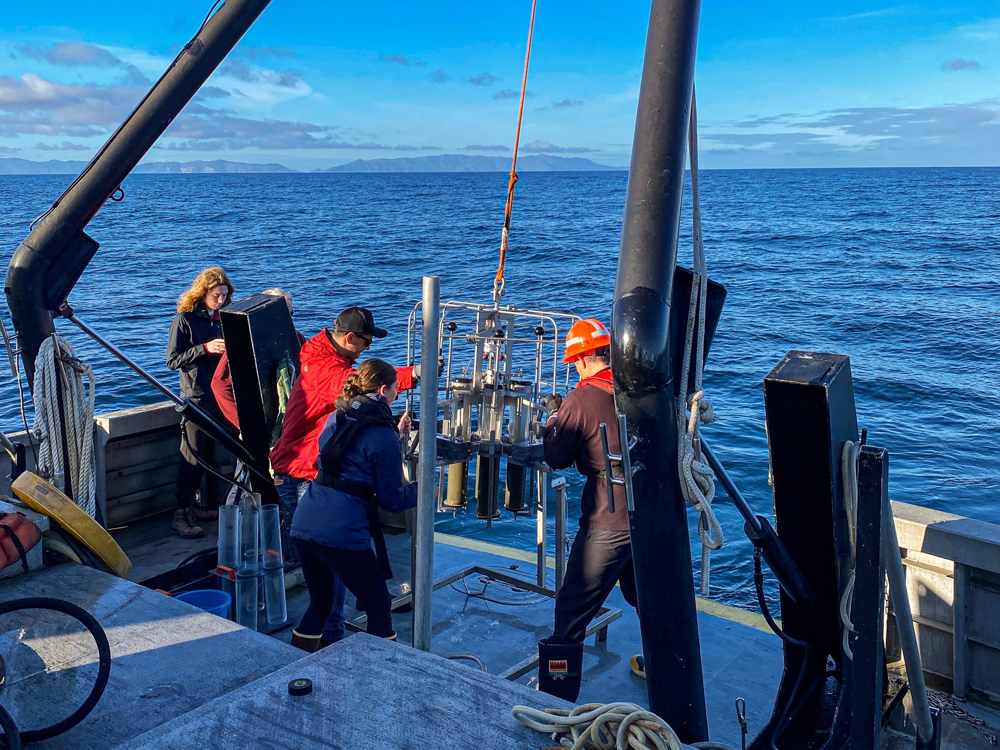

## Overview

Two strands of work in the Valentine Lab at the University of California, Santa Barbara, joined by a single subject: what reaches the floor of the Southern California Bight, and what the microbial community there does with it.

The first is legacy contamination. Industrial DDT waste was discharged into the deep ocean off Southern California for decades, and the record of it sits in the sediment of the San Pedro Basin. I sailed the coring cruise that collected sediment from the disposal site, and the cores feed both a published inventory of the dumping and a thesis on how that contamination has structured the microbial communities living in it.

The second is hydrocarbons, and the question is the opposite way round: not what a contaminant does to a community, but whether a community already primed on natural hydrocarbons can absorb one. Coal Oil Point sits on one of the largest natural seep fields in the world, and the ocean's short-term, phytoplankton-derived alkane cycle runs there alongside the long-term petroleum cycle.[^proposal] I wrote the proposal that funds that work and built the substrate delivery method it depends on.

Published from these cores

Journal article, group author

Wu, M. S. C., J. T. Schmidt, H. E. Kittner, <strong>Earth 182B Group</strong> and D. L. Valentine. 2025. Geospatial and temporal inventory for industrial DDT waste disposal to a deep coastal ocean environment. <em>Environmental Science and Technology</em> 59: 20578 to 20587.

<a class="cite-chip" href="https://doi.org/10.1021/acs.est.5c03851" target="_blank" rel="noopener"><i class="bi bi-journal-text" aria-hidden="true"></i>Read the Paper</a>
<a class="cite-chip" href="files/wu_2025_acs.pdf" download><i class="bi bi-download" aria-hidden="true"></i>Download the PDF</a>

Master's thesis, acknowledged

Kittner, H. E. 2024. <em>Anthropogenic Structuring of Microbial Communities in Deep Coastal Sediment</em>. Master's thesis, University of California, Santa Barbara.

<a class="cite-chip" href="https://escholarship.org/uc/item/8zr6c2cg" target="_blank" rel="noopener"><i class="bi bi-mortarboard" aria-hidden="true"></i>Read the Thesis</a>

## Quick Facts

- **Role:** Research Intern, Valentine Lab, University of California, Santa Barbara
- **When:** January 2023 to August 2025
- **Where:** San Pedro Basin aboard the research vessel *Yellowfin*; Coal Oil Point; the Valentine Lab; the Bridges-2 system at the Pittsburgh Supercomputing Center
- **Skills:** sediment coring at sea, liposome preparation for delivering lipophilic substrates, metagenomic sequence processing in Bash
- **Funding:** Coastal Fund, University of California, Santa Barbara, 8,100 dollars, 2024 to 2026, awarded in my name for *Microbial Hydrocarbon Cycling at Coal Oil Point*
- **Credits:** group author on Wu et al. 2025; acknowledged in Kittner 2024
- **Code:** <https://github.com/jadenorli>

## Legacy DDT in the San Pedro Basin

**The cruise.** In March 2023 I sailed a sediment coring cruise aboard the research vessel *Yellowfin* over the San Pedro Basin disposal site, and collected the core that carries into both outputs below.

**The inventory.** Wu et al. 2025, in *Environmental Science and Technology*, assembles a geospatial and temporal inventory of industrial DDT waste disposal to the deep coastal ocean. The paper lists the Earth 182B Group as an author, a cohort credit for the course built around the disposal site material, where the projects drawing on those cores were worked through as a group. I am named inside that consortium.

**The thesis.** The same sediment supports Hailie Kittner's master's thesis on anthropogenic structuring of microbial communities in deep coastal sediment, which acknowledges the collection work.

<!-- ROOM FOR CRUISE PHOTOGRAPHS.
     This page has one image and it is the hero. Two or three from the
     Yellowfin would carry this section: the corer going over the side or
     coming back aboard, a core on deck or being extruded, and the bench where
     the sections were logged. Markup, matching the nicothoid figure tiles:

     

       <figure>
         
         <figcaption>Coring. CAPTION</figcaption>
       </figure>
     

-->

## Hydrocarbon Cycling at Coal Oil Point

### The question

Hydrocarbons reach the ocean on two clocks. On the long clock, petroleum forms in the crust and escapes through natural seeps, or arrives through spills. On the short clock, phytoplankton produce alkanes and build them into their membranes, at a scale that dwarfs the seep input. Those biogenic alkanes are not accumulating, so something is eating them, and metagenomic work in the lab points at archaea, Marine Group II in particular. That is a surprise, because oxic petroleum biodegradation studies almost always turn up bacteria instead.

Marine Group II archaea are the dominant archaeal group in Santa Barbara Channel surface water and are notoriously hard to culture, so their ecological role is largely unresolved. The question the project asks is whether the short-term cycle primes the ocean with consumers that can act as a biofilter when petroleum arrives, and Coal Oil Point is the natural laboratory for asking it: a place where both cycles have run side by side for a very long time.

### Delivering an alkane the way a cell does

Testing that question has a methodological problem at its center. If the biogenic treatment is an alkane added as an oil droplet and the petroleum treatment is oil, the two differ in physical form as well as in origin, and the comparison no longer isolates what it is meant to isolate. The alkane has to be presented the way a phytoplankton cell presents it, held in a lipid membrane.

That is what the liposome is for, and preparing one that carries an alkane is the part I built. A literature search led me to thin-film hydration, the standard route to a multilamellar vesicle: lipids are dissolved in a chloroform and methanol mixture, the solvent is driven off by rotary evaporation to leave a film on the flask wall, and the film is hydrated above the lipid transition temperature.[^thinfilm] What makes it the right method here is where the cargo goes in. A lipophilic compound is dissolved into the lipid solution before the film is cast, so it ends up held in the bilayer rather than in the aqueous interior, which is exactly the arrangement a phytoplankton membrane presents.[^bilayer] I adapted that protocol to carry pentadecane for the Marine Group II treatments, with oil for the petroleum comparison. It exists as a written method prepared for the incubations rather than one that has been run.

### Design

Seawater is collected from Coal Oil Point using the campus small craft fleet, timed to summer, when Marine Group II typically increase in the channel. Samples are incubated for roughly 72 hours across four treatments, crossing what the carbon is against how it is presented:

::: {.table-card}

| Treatment | Carbon source | Presented as | What it isolates |
|---|---|---|---|
| Liposome with alkane | Biogenic, pentadecane | Held in a lipid bilayer | The short-clock cycle as a cell offers it |
| Liposome with petroleum | Petroleum | Held in a lipid bilayer | Origin, with physical form held constant |
| Alkane alone | Biogenic, pentadecane | Free in seawater | Presentation, with origin held constant |
| Petroleum alone | Petroleum | Free in seawater | Conventional oil exposure, as a reference |

:::

After incubation the samples are filtered, DNA extracted, and preserved for cell counts, with sequencing on the AVITI platform at the DNA Technologies Core at the University of California, Davis. Analysis pairs archaeal-inclusive amplicon profiling of the whole prokaryotic community with quantitative real-time polymerase chain reaction against Marine Group II 16S ribosomal RNA primers, so that a shift in the community and a change in archaeal abundance can be read against each other.

### Training for the analysis

Alongside the proposal I trained in the analysis it calls for, learning metagenomic sequence processing end to end in Bash on the Bridges-2 system at the Pittsburgh Supercomputing Center, under Dr. Eleanor Arrington.

## Status

The two strands sit at different stages. The San Pedro Basin work is finished and published: the cruise sailed, the cores were collected, and both the inventory paper and the thesis are out. The Coal Oil Point work is funded and specified, with the proposal presented to the lab and the liposome method written up, but the incubations have not been run and there are no results to report.

## Acknowledgments

Valentine Lab at the University of California, Santa Barbara: Dr. David Valentine and Dr. Eleanor Arrington, who mentored the Coal Oil Point work. The crew of the research vessel *Yellowfin*. The Earth 182B cohort. Funded in part by the Coastal Fund at the University of California, Santa Barbara.

<a class="read-more" href="research.html">Back to Research</a>
<a class="btn btn-primary" href="contact.html">Contact</a>

[^proposal]: Question, study site rationale, treatments, and sequencing plan from the Coastal Fund proposal and its presentation, *Microbial Hydrocarbon Cycling at Coal Oil Point*, Valentine Lab, University of California, Santa Barbara.

[^thinfilm]: The thin-film hydration route to a multilamellar vesicle. Šturm, L., and N. Poklar Ulrih. 2021. Basic methods for preparation of liposomes and studying their interactions with different compounds, with the emphasis on polyphenols. *International Journal of Molecular Sciences* 22(12): 6547. <https://doi.org/10.3390/ijms22126547>

[^bilayer]: The same placement of a lipophilic cargo in the bilayer rather than the aqueous interior, there for hydrophobic nanoparticles. De Leo, V., A. M. Maurelli, L. Giotta and L. Catucci. 2022. Liposomes containing nanoparticles: preparation and applications. *Colloids and Surfaces B: Biointerfaces* 218: 112737. <https://doi.org/10.1016/j.colsurfb.2022.112737>
