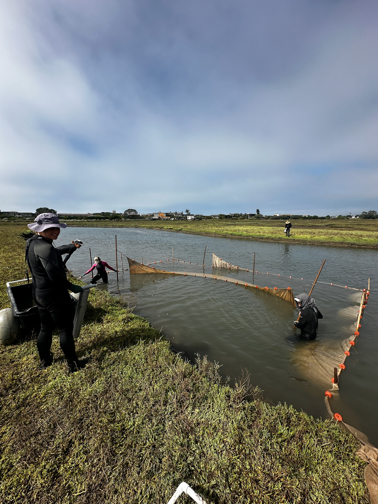
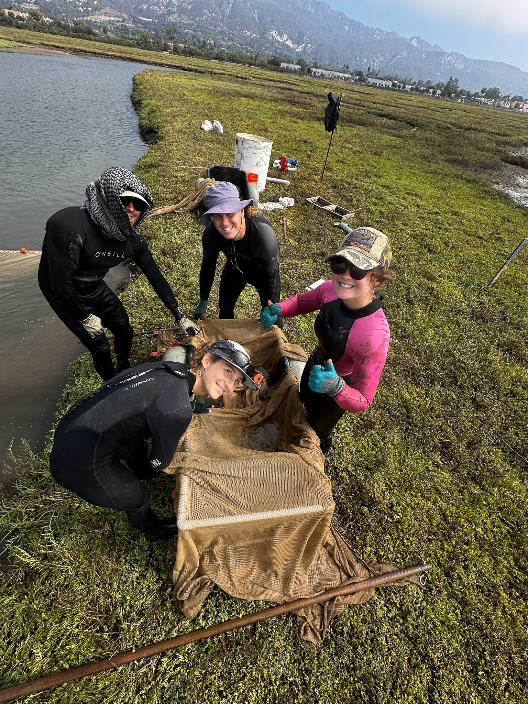
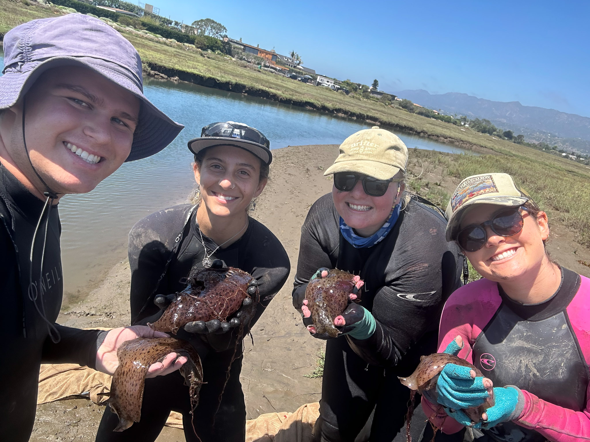
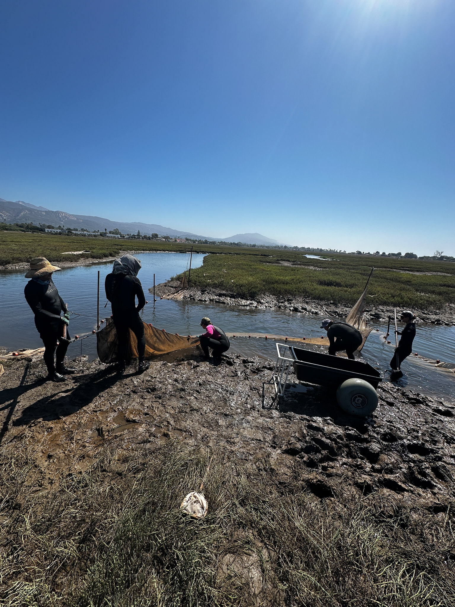
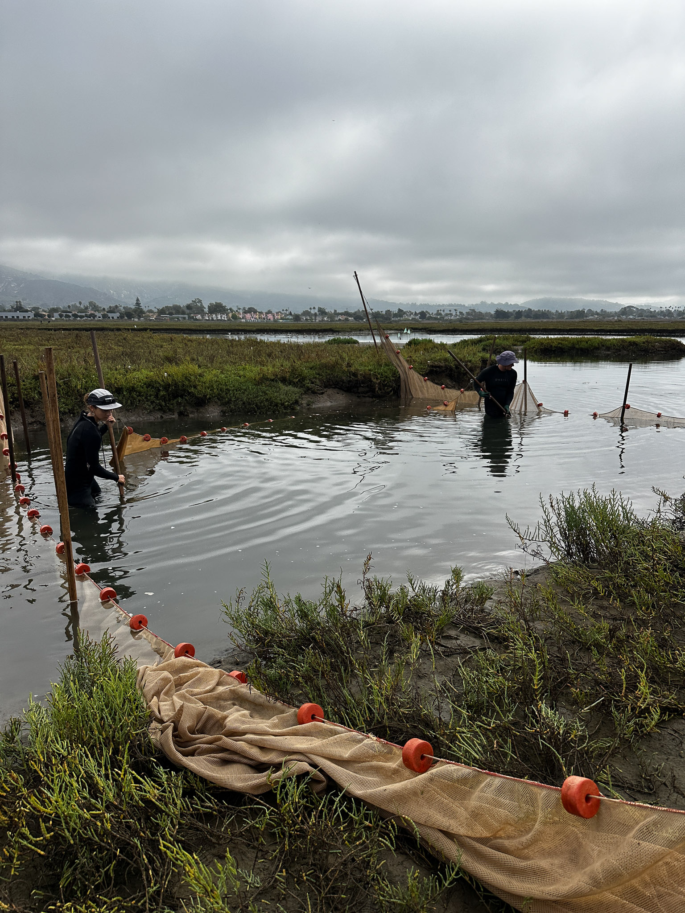

<!-- Hero slideshow (styles come from global style.css) -->

  
  
  
  
  

 

## Overview
The UCSB-led SONGS Mitigation Monitoring Program provides independent scientific oversight for **two** California Coastal Commission required mitigation projects: the **Wheeler North Artificial Reef** (kelp-forest habitat) and the **San Dieguito Lagoon Restoration** (coastal wetland).[^overview] The reef’s permit standards require sustaining **≥150 acres** of medium-to-high density giant kelp and **≥28 tons** of reef fish standing stock,[^reef-standards] while the wetland permit (**Condition A**) requires creation or substantial restoration of **≥150 acres** of tidal wetlands in Southern California—implemented at San Dieguito as ~**115 acres** of new tidal wetlands plus **~35 acres** of enhancement credit for maintaining an open tidal inlet.[^wetland-standards]

Within the wetland program, the restored San Dieguito site is evaluated **relative to natural reference marshes**. My role focuses on two of those **reference sites** (**Carpinteria Salt Marsh Reserve** and **Point Mugu Lagoon**) where I help run standardized fish and invertebrate community surveys, identify and process samples in the lab, and support QA/QC. I do not sample at the San Dieguito restoration directly, but our reference-site data provide the benchmarks used to assess restoration performance over time.[^ref-sites]

## Quick Facts
- **Role:** Lab Technician (UCSB)  
- **When:** Aug 2025 – present  
- **Skills:** community sampling, species ID, sample processing, data QA/QC, field & lab equipment  
- **Links:** Program site: <https://marinemitigation.msi.ucsb.edu/>

## Background and Questions
This work tracks community composition and ecological recovery in restored and reference salt marshes. We ask: How do fish and invertebrate assemblages change over time? Are restoration targets being met? Which environmental factors co-vary with community structure, and where might remediation improve performance?

## Methods 
- Standardized community surveys (e.g., gear deployment, timed/count protocols)  
- Lab processing of collected samples (ID, measurements)  
- Data management and QA/QC workflows to support long-term reporting

## Results (preview)
- Field season progress notes and initial summaries (coming soon).  
- Annual report excerpts will be linked here when available.

## Outputs
- Report (coming soon)  

## Acknowledgements
SONGS Mitigation Monitoring Program team, Marine Science Institute (UCSB), collaborators and partners.

---
[^overview]: UCSB Marine Science Institute — *SONGS Mitigation Monitoring Program* (program overview and components). <https://marinemitigation.msi.ucsb.edu/>
[^reef-standards]: *Artificial Reef* page and reef monitoring/permit materials describing standards for ≥150 acres kelp and ≥28 tons reef fish standing stock. See: <https://marinemitigation.msi.ucsb.edu/artificial-reef> and Monitoring Plan PDF.
[^wetland-standards]: *Wetland* pages describing Condition A (≥150 acres tidal wetlands) and the San Dieguito implementation (~115 acres creation + ~35 acres enhancement credit for inlet maintenance). See: <https://marinemitigation.msi.ucsb.edu/wetland/restoration-planning-construction/restoration-planning>.
[^ref-sites]: Wetland monitoring uses natural reference sites to benchmark San Dieguito’s performance; the program identifies Tijuana Estuary, Point Mugu Lagoon, and Carpinteria Salt Marsh Reserve as reference wetlands. See the wetland monitoring/plan materials on the SONGS site.
