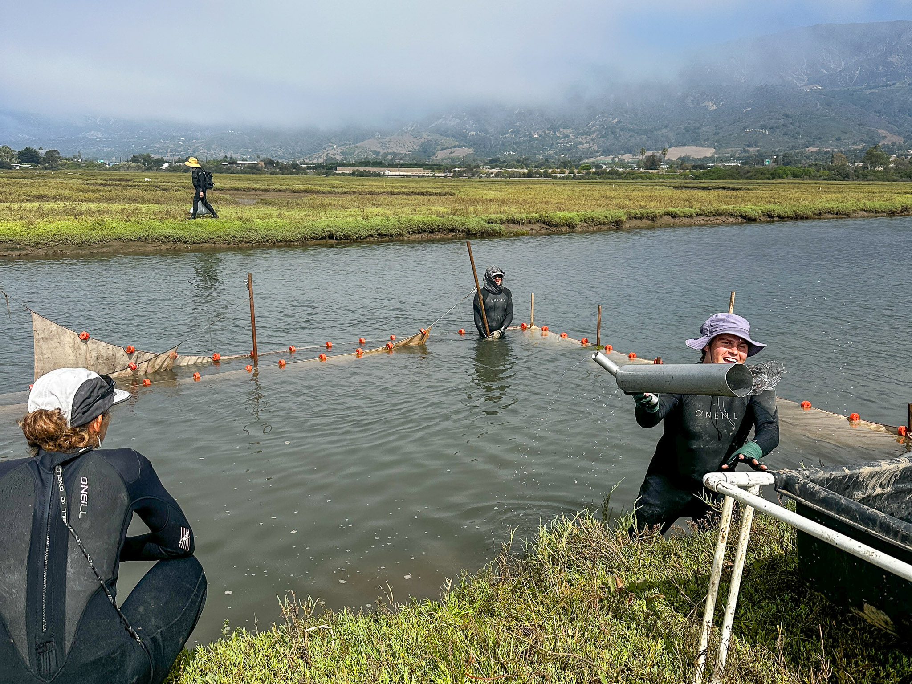
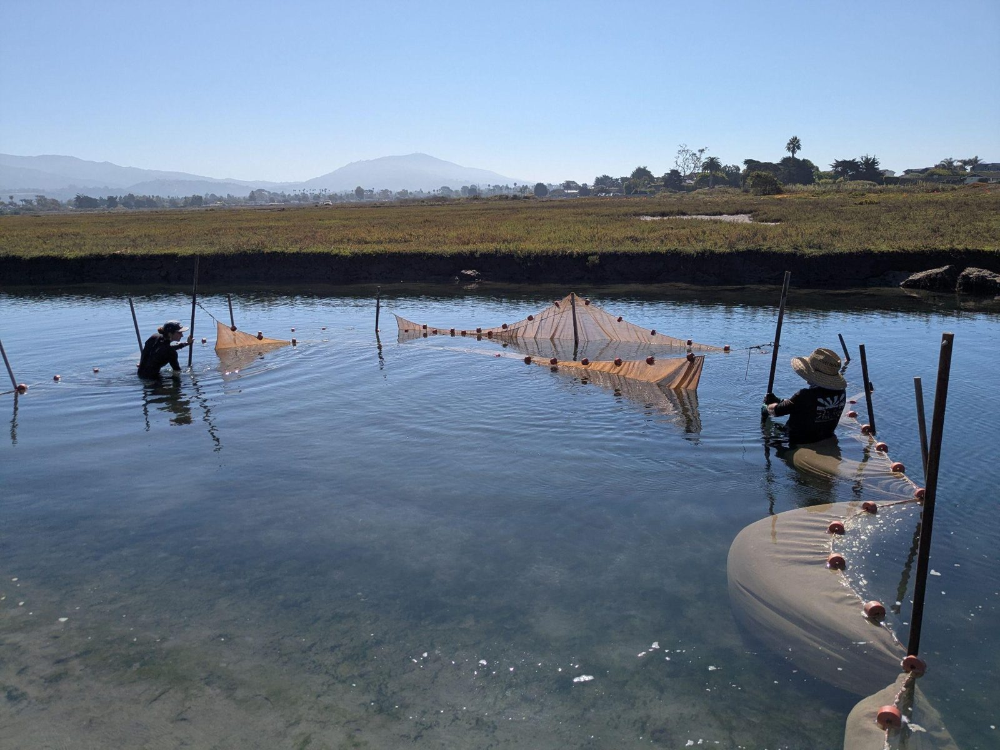
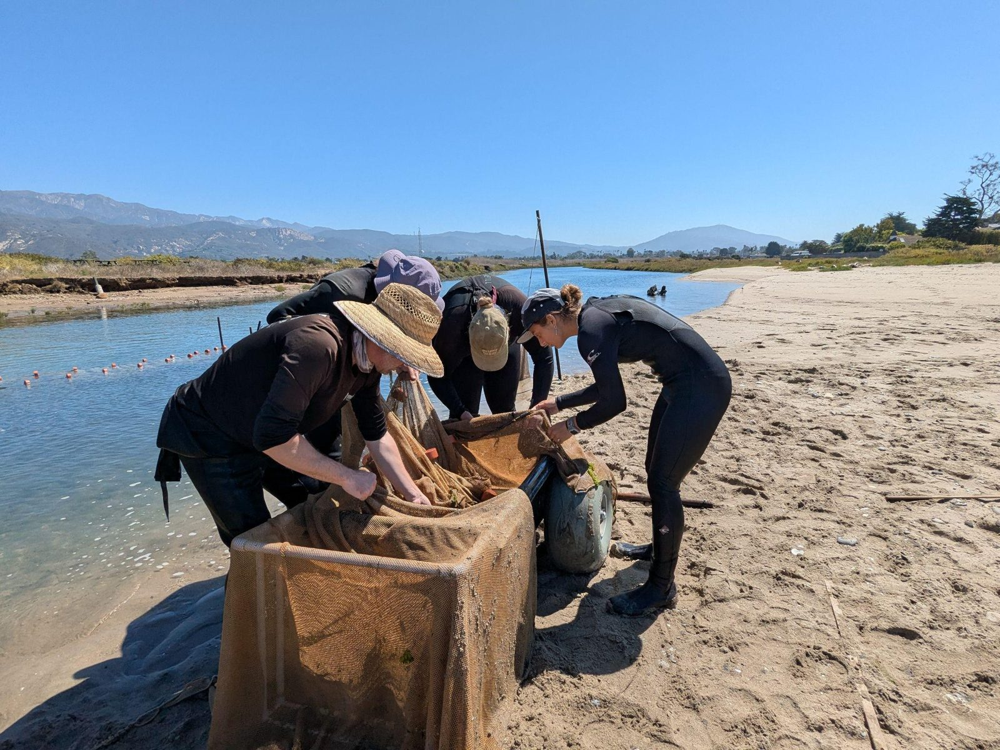
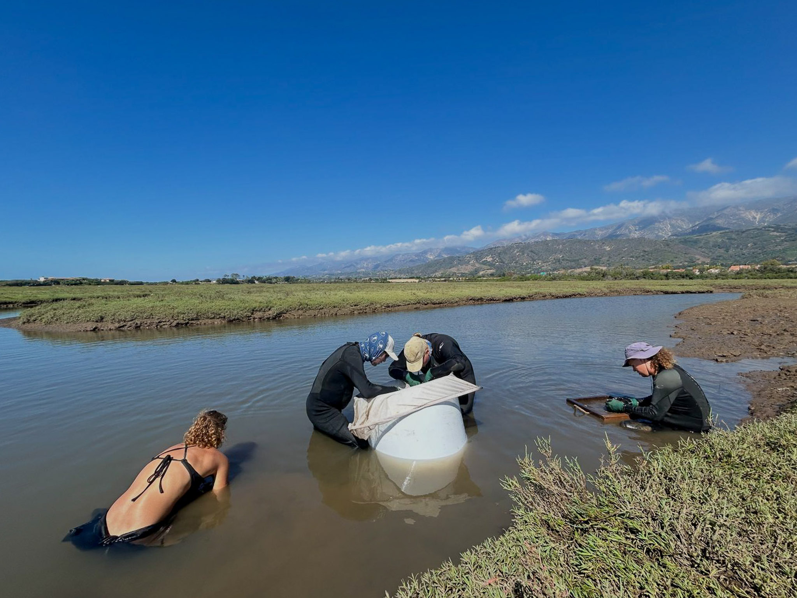
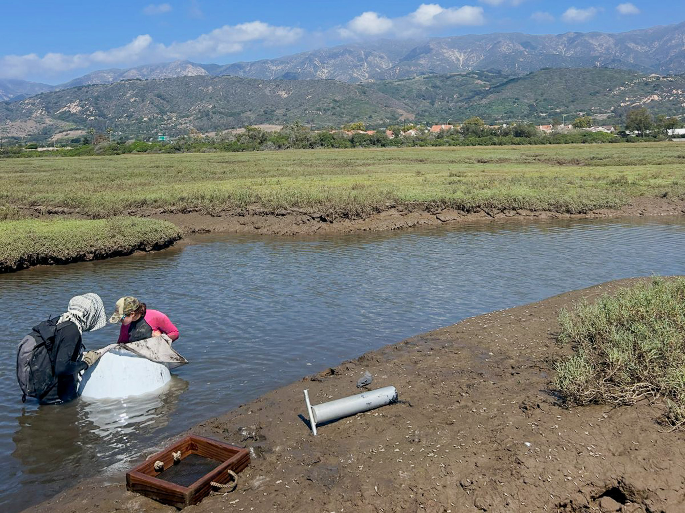
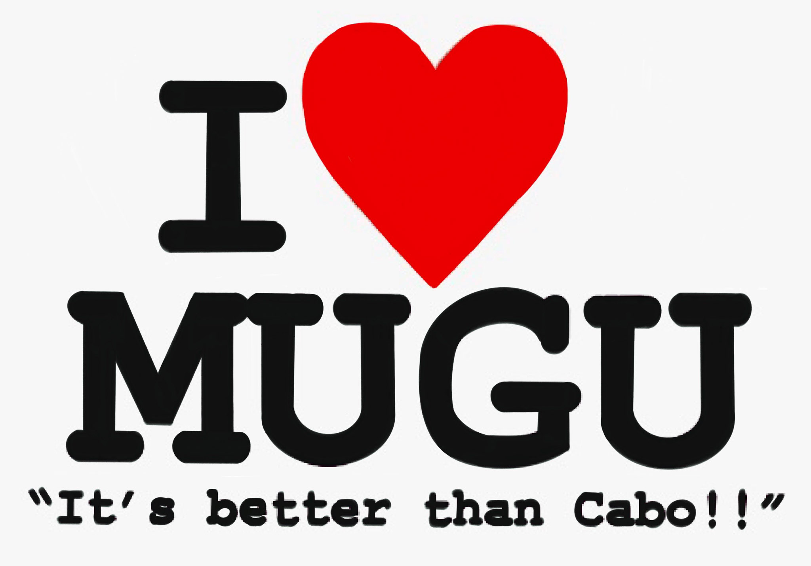
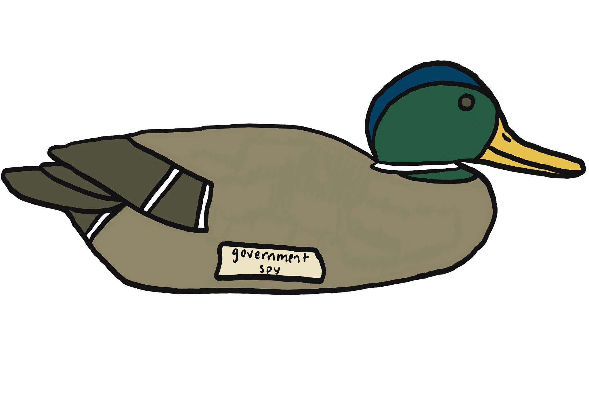

<!-- Hero slideshow. Styles from section 17 of styles.css, timer from
     scripts/site.js, which initialises every .hero-slideshow on the site. -->

  
  
  
  
  

## Overview

When the San Onofre Nuclear Generating Station was permitted, the California Coastal Commission required it to offset the damage it did to coastal habitat. Two mitigation projects came out of that requirement, and both carry numerical standards written into the permit. The [SONGS Mitigation Monitoring Program](https://marinemitigation.msi.ucsb.edu/), led by the University of California, Santa Barbara, is the independent scientific oversight that decides whether those standards are being met.[^overview]

::: {.table-card}

| Mitigation project | Habitat | What the permit requires |
|---|---|---|
| [Wheeler North Artificial Reef](https://marinemitigation.msi.ucsb.edu/artificial-reef) | Kelp forest | At least 150 acres of medium to high density giant kelp, and at least 28 tons of reef fish standing stock[^reef-standards] |
| [San Dieguito Lagoon Restoration](https://marinemitigation.msi.ucsb.edu/wetland/restoration-planning-construction/restoration-planning) | Coastal wetland | At least 150 acres of tidal wetland created or substantially restored, met as roughly 115 acres of new wetland plus about 35 acres of credit for keeping the tidal inlet open[^wetland-standards] |

:::

A standard like that is only meaningful against something. Alongside the acreage targets, the wetland project is held to fifteen relative performance standards, judged against natural reference marshes rather than against fixed numbers, because a marsh in a wet year and a marsh in a dry one are not the same marsh. The rule is comparative all the way down: to earn mitigation credit, the share of standards the restoration meets has to match or beat the share met by the weakest reference wetland.[^ref-sites]

My work was on the reference side of that comparison, at Carpinteria Salt Marsh Reserve and Point Mugu Lagoon: running standardized fish and invertebrate surveys, identifying and processing the catch in the laboratory, and checking the data that came out. I never sampled at the restoration itself. The numbers I helped collect are the baseline the restoration gets measured against, which is the less visible half of a mitigation program and the half that decides what the other half means.

Where this monitoring lands

Annual report to the California Coastal Commission

Beheshti, K. M., R. S. Smith, H. M. Page and D. C. Reed. 2026. <em>2025 Wetland Annual Report</em>. SONGS Mitigation Monitoring Program, Marine Science Institute, University of California, Santa Barbara. Submitted to the California Coastal Commission, August 2026.

<a class="cite-chip" href="files/songs_report_2025.pdf" download><i class="bi bi-file-earmark-pdf" aria-hidden="true"></i>Read the 2025 Report</a>
<a class="cite-chip" href="https://marinemitigation.msi.ucsb.edu/data" target="_blank" rel="noopener"><i class="bi bi-database" aria-hidden="true"></i>Program Data Portal</a>

## Quick Facts

- **Role:** Laboratory Technician, Marine Science Institute, University of California, Santa Barbara
- **When:** August 2025 to January 2026
- **Where:** Carpinteria Salt Marsh Reserve and Point Mugu Lagoon, and the laboratory at the Marine Science Institute
- **Skills:** standardized community sampling, fish and invertebrate identification, sample processing and measurement, data entry and quality control
- **Program:** <https://marinemitigation.msi.ucsb.edu/>

## Background and Questions

Long-term monitoring of this kind asks a small number of questions over and over, which is what makes the answers worth anything:

- How do fish and invertebrate assemblages in these marshes change from season to season and year to year?
- Are the restoration targets in the permit being met, judged against reference conditions rather than against a fixed number?
- Which environmental conditions move with community structure, and where would remediation actually help?

## Methods

The program's wetland monitoring plan sets out how every one of these measurements is taken, so that a number from one marsh in one year is comparable with a number from another marsh a decade earlier.[^plan]

**Fish, by two methods.** Fish are sampled in two habitat types, tidal creeks and main channel, at six locations of each type per wetland, by two methods that catch different animals. Circular enclosure traps, 0.4 square meters and 0.9 meters tall, are dropped in water no more than 0.7 meters deep and worked with a hand net until three hauls come up empty. They exist for the gobies: small, abundant, bottom-sitting fish that other gear passes straight over. Beach seines with blocking nets take the larger and more mobile fish. Blocking nets are rolled out 7.6 meters apart, perpendicular to shore, out to about 1.5 meters depth or 12.2 meters from shore, whichever comes first, and then closed. A beach seine two meters high and 7.6 meters wide is hauled through the blocked area five times, and the blocking nets themselves are pulled in and sampled afterwards, because fish end up in them too. Everything is identified and counted in the field and returned alive, with voucher specimens kept only where an identification is uncertain.

**Timing, which is not incidental.** Fish sampling happens on three separate dates in early fall, with the sampled area offset each time so that one visit does not degrade the habitat the next visit measures. Early fall is chosen to stay clear of Ridgway's rail nesting. Sampling is daytime only and restricted to comparable tides across all the wetlands, since a marsh at one tide is not the same marsh at another.

**Invertebrates, by three.** Macroinvertebrates are sampled alongside the enclosure stations. Epifauna, such as the California horn snail, are counted in quadrats down the unvegetated bank from the vegetation line to the thalweg. Larger infauna, jackknife clams and ghost shrimp, come from a ten centimeter core pushed up to fifty centimeters into the sediment and sieved through three millimeter mesh in the field. The smallest animals, most annelids and the amphipods, come from a narrow three and a half centimeter core taken only six centimeters deep, preserved on site and worked through half millimeter mesh under a microscope back in the laboratory. Three sizes of animal, three ways of catching them, because no single method sees them all.

<figure>
  
  <figcaption>Block nets. Two nets close off a reach before any seining starts, so the same water is fished each time.</figcaption>
</figure>

<figure>
  
  <figcaption>The haul. A 25 meter seine pulled through the enclosure, weighted below and floated above so it works the bottom.</figcaption>
</figure>

<figure>
  
  <figcaption>Sorting. The net comes up into the cart and everything in it is counted and identified on the bank.</figcaption>
</figure>

<figure>
  
  <figcaption>Goby enclosure. A smaller trap dropped and then netted around the perimeter, for the benthic species a seine passes over.</figcaption>
</figure>

<figure>
  
  <figcaption>Cores. A large core sieved on the bank, for the clams, shrimp and worms a net never sees.</figcaption>
</figure>

<!-- ROOM FOR MORE, and the grid stays even at six. Drop files into
     images/research/ and uncomment. Best candidate by far is the sorting
     tray with worms and amphipods picked out of the sieve: the smallest
     animals are a third of the method and nobody ever photographs them.

<figure>
  
  <figcaption>Sorting the sieve. CAPTION</figcaption>
</figure>
-->

**In the laboratory and after.** Catch is identified to the lowest practical taxonomic level, measured and processed, which is where a survey stops being a bucket of animals and becomes data. Then data entry and the checking that follows, reconciling sheets against samples before anything reaches the program's long-term record. A reference dataset is only useful if a value from 2025 can be trusted next to one from 2005.

## Status

The appointment ran from August 2025 to January 2026 and has ended. The data went into the program's long-term record rather than into anything of mine, and the reporting is the program's to publish. The 2025 season is covered by the annual report above, which reports that in the fourteenth year of monitoring the restoration again did not earn mitigation credit, and attributes that to unplanned habitat conversion and to a lack of similarity to the reference wetlands on some biological attributes. All of the underlying data are public.

## SONGS Stickers

Long-term monitoring is a small crew going back to the same four marshes, season after season, for years. Traditions accumulate. So do stickers.

<figure>
  
  <figcaption>Point Mugu is a working naval installation and the lagoon sits inside it, so a day of fish sampling starts at a gate with a badge and an escort.</figcaption>
</figure>

<figure>
  
  <figcaption>The mallards on the base are, as far as anyone has been able to establish, entirely ordinary mallards with no security clearance whatsoever.</figcaption>
</figure>

## Acknowledgments

The SONGS Mitigation Monitoring Program team, the Marine Science Institute at the University of California, Santa Barbara, and the reserve and lagoon staff who make access to those sites possible.

<a class="read-more" href="research.html">Back to Research</a>
<a class="btn btn-primary" href="contact.html">Contact</a>

[^overview]: Marine Science Institute, University of California, Santa Barbara. *SONGS Mitigation Monitoring Program*, program overview and components. <https://marinemitigation.msi.ucsb.edu/>

[^reef-standards]: Artificial reef monitoring and permit materials describing the kelp and reef fish standing stock standards. <https://marinemitigation.msi.ucsb.edu/artificial-reef>

[^wetland-standards]: Wetland pages describing Condition A and how it is met at San Dieguito. <https://marinemitigation.msi.ucsb.edu/wetland/restoration-planning-construction/restoration-planning>

[^plan]: SONGS Mitigation Monitoring Program. *Monitoring Plan for the SONGS Wetland Restoration Project*, updated May 2022. Gear dimensions, station spacing, habitat definitions, timing windows and the standardization of densities all come from this document.

[^ref-sites]: The permit requires reference wetlands to be relatively undisturbed, tidal and within the Southern California Bight. Forty six candidates were evaluated; Tijuana River Estuary, Mugu Lagoon and Carpinteria Salt Marsh were chosen originally, and in 2024 Los Peñasquitos Lagoon replaced Tijuana River Estuary, which sewage flows had made unsuitable. Beheshti et al. 2026, section 2.3.
